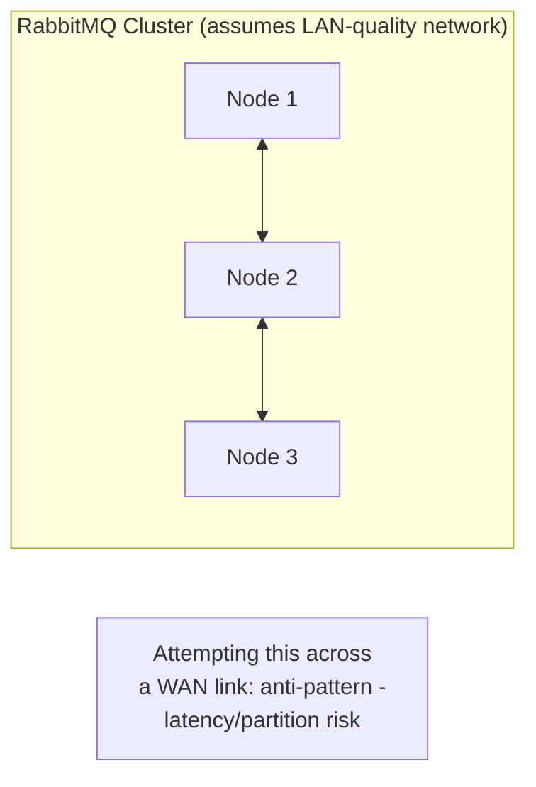
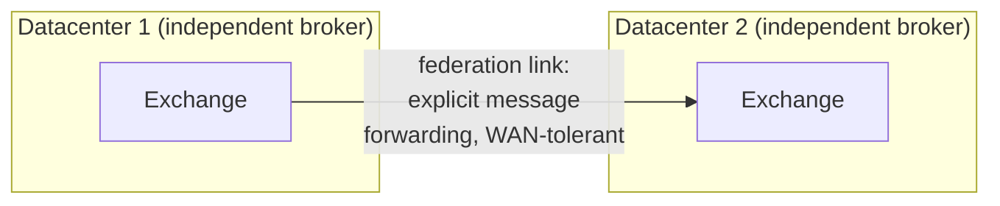

# RabbitMQ — Professional

<!-- level-focus -->
At professional level, focus on this question:

> How do you design RabbitMQ topology across multiple datacenters, and
> what's the real difference between clustering and federation?

Prerequisite: [`senior.md`](senior.md).

---

## Clustering: tightly-coupled, low-latency, single logical broker

A RabbitMQ **cluster** (what `senior.md` covered) assumes nodes are
connected by a **low-latency, reliable** network — nodes share full
metadata about every queue/exchange, and quorum queues' Raft replication
assumes fast round trips between replicas. This makes clustering
fundamentally unsuitable for connecting nodes across **geographically
distant** datacenters, where network latency and reliability don't meet
these assumptions — attempting to cluster across a WAN link is a
well-documented RabbitMQ anti-pattern, risking split-brain-like
partition behavior and severe performance degradation.



## Federation: loosely-coupled, WAN-tolerant, explicit message forwarding

**Federation** is RabbitMQ's purpose-built answer for connecting brokers
across datacenters: rather than clustering (shared state, tight coupling),
a federation link explicitly **forwards messages** from an exchange/queue
in one broker to an exchange/queue in another **independent** broker,
tolerating network latency and even temporary disconnection (buffering
and catching up once reconnected) far better than clustering's tight
consistency assumptions.



The professional-level distinction: clustering makes multiple nodes
**behave as one logical broker** (shared state, low-latency assumption);
federation connects **genuinely independent** brokers via an explicit,
resilient forwarding mechanism designed for exactly the WAN
latency/reliability conditions clustering cannot tolerate — this is a
direct application of the geographic-failure-domain reasoning from the
Deployment Stamps & Geodes professional page, choosing the right
coupling mechanism for the actual network distance involved.

## Production checklist (staff-level)

1. **Never cluster RabbitMQ nodes across datacenters/regions** — this is
   a well-documented anti-pattern; use federation (or shovel, a simpler
   point-to-point message-forwarding alternative) for cross-datacenter
   connectivity instead.
2. **Choose quorum queues for any queue requiring genuine node-failure
   tolerance within a single cluster**, accepting the Raft-replication
   latency cost (`senior.md`) as the price of that guarantee.
3. **Design federation topology deliberately around your actual
   cross-datacenter data flow requirements** (one-way forwarding? bidirectional?
   which exchanges need to span datacenters?) rather than federating
   everything uniformly.
4. **Monitor federation link health and lag as a distinct metric** from
   intra-cluster queue health — a federation link's WAN-tolerant buffering
   means a temporarily disconnected link can silently accumulate lag that
   deserves its own alerting.
5. **In an architecture review for a multi-region RabbitMQ deployment,
   require an explicit topology diagram distinguishing clustered
   (intra-datacenter) from federated (inter-datacenter) connections** —
   conflating the two in a design is the root cause of the
   clustering-across-a-WAN anti-pattern.

## Cheat Sheet

```text
+------------------------------------------------------------------+
|                   RABBITMQ — INTERNALS & SCALE                      |
+------------------------------------------------------------------+
| CLUSTERING: tight coupling, shared metadata, assumes LOW-LATENCY,      |
| RELIABLE network (LAN-quality) - quorum queues' Raft replication       |
| assumes fast round trips. NEVER cluster across a WAN/datacenters -     |
| well-documented anti-pattern (partition risk, severe degradation)      |
+------------------------------------------------------------------+
| FEDERATION: loosely-coupled, INDEPENDENT brokers connected by          |
| explicit message-forwarding links - tolerates WAN latency and even     |
| temporary disconnection (buffers, catches up on reconnect) - the       |
| purpose-built answer for cross-datacenter connectivity                 |
+------------------------------------------------------------------+
| Quorum queues (senior.md) trade write latency for node-failure         |
| tolerance WITHIN one cluster; federation trades consistency/coupling   |
| for WAN tolerance ACROSS clusters - different problems, different       |
| mechanisms, don't conflate them                                        |
+------------------------------------------------------------------+
```

## Test yourself

1. Why does clustering RabbitMQ nodes across a WAN link risk partition-
   like behavior and severe performance degradation?
2. Why can federation tolerate temporary disconnection between
   datacenters in a way that clustering cannot?
3. Design the topology (cluster vs. federation boundaries) for a system
   with 3 nodes in each of 2 datacenters (US and EU), needing some events
   to flow between regions and others to stay purely local.

## Further Reading

- RabbitMQ documentation — "Clustering Guide," "Federation," and "Shovel"
  (the specific WAN-tolerant connectivity mechanisms).
- See also: [Message Queues — professional](../01-message-queues/professional.md),
  [Deployment Stamps & Geodes — professional](../../../distributed-system/20-reliability-patterns/08-deployment-stamps-and-geodes/professional.md).
