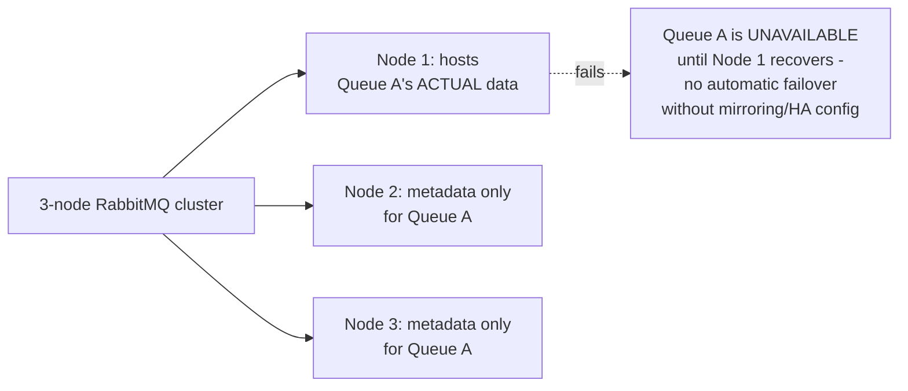
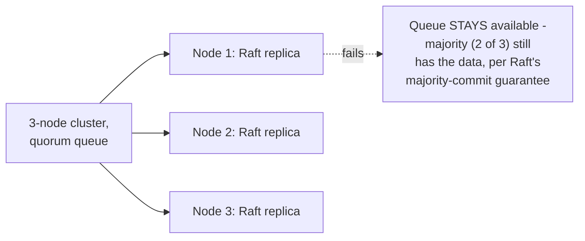

# RabbitMQ — Senior

<!-- level-focus -->
At senior level, focus on this question:

> In a RabbitMQ cluster, where does a queue's actual data live, and why
> does that matter for both performance and availability?

Prerequisite: [`middle.md`](middle.md).

---

## Classic queues: data lives on ONE node, by default

A **classic queue** in RabbitMQ, by default, has its actual message data
living on **exactly one** node in the cluster (the "queue master" in
legacy terminology) — every other node just knows the queue exists (for
routing purposes) but doesn't hold its data. If that one node fails, the
queue becomes unavailable until it recovers, **unless** you've configured
high-availability mirroring (legacy) or migrated to quorum queues (modern).

## Quorum queues: Raft-replicated across multiple nodes

Modern RabbitMQ's **quorum queues** (per
[Message Queues — professional](../01-message-queues/professional.md))
replicate a queue's data across multiple nodes using Raft, meaning a
single node failure doesn't make the queue unavailable — this is the
direct, recommended replacement for classic queues (with or without legacy
mirroring) for any workload requiring genuine high availability.

## Performance trade-off: replication cost

> 🎯 **Senior takeaway:** quorum queues' availability comes at a real
> cost — every write must achieve Raft majority commitment (a network
> round trip to a majority of replicas) before being acknowledged, higher
> latency than a classic queue's single-node write. Choose classic queues
> for throughput-sensitive, availability-tolerant workloads (a queue whose
> brief unavailability during a node failure is acceptable); choose
> quorum queues when you need the queue itself to survive a node failure
> without interruption, and are willing to pay the replication latency
> cost for that guarantee.

## Test yourself

1. Why does a classic queue become unavailable if its hosting node fails,
   while other nodes in the cluster remain healthy?
2. Why do quorum queues cost more write latency than classic queues, and
   what specific mechanism causes that cost?
3. For a low-priority background job queue where occasional brief
   unavailability during a node failure is tolerable, would you choose
   classic or quorum queues? Why?

Continue to [`professional.md`](professional.md) to design multi-
datacenter RabbitMQ topology at scale.
