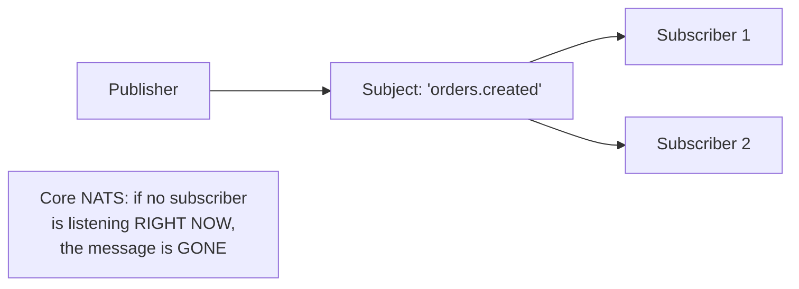

# NATS

> A famously simple, lightweight, high-performance messaging system —
> Core NATS is fire-and-forget pub/sub with no persistence at all;
> JetStream adds an optional persistence layer on top, letting you opt
> into durability only where you actually need it.

## Choose a level

| Level | Guide | You are done when |
|---|---|---|
| Junior | [Core NATS: simple and fast](junior.md) | You can explain why Core NATS is at-most-once by design, and why that's a deliberate trade-off, not an oversight. |
| Middle | [Subjects and wildcards](middle.md) | You can design a subject hierarchy and wildcard subscription pattern. |
| Senior | [JetStream: opting into persistence](senior.md) | You can explain what JetStream adds and how it changes the delivery guarantee. |
| Professional | [NATS at scale](professional.md) | You can design a clustered, multi-region NATS topology using leaf nodes. |

## Practice rule

Before choosing NATS Core over JetStream (or vice versa) for a message
type, ask: "if a subscriber isn't currently connected when this message
is published, is losing it acceptable?" If yes, Core NATS's simplicity
and speed are a good fit; if no, you need JetStream's persistence.

## Related

- [Message Queues](../01-message-queues/README.md)
- [Delivery Guarantees](../05-delivery-guarantees/README.md)
