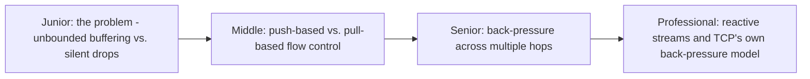
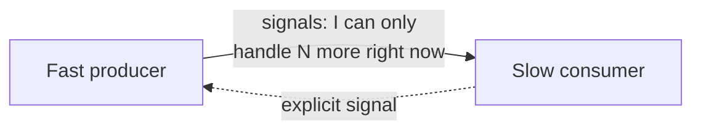

# Back-Pressure

> When a consumer can't keep up with a producer, something has to give —
> back-pressure is the umbrella term for mechanisms that explicitly signal
> "slow down" back up the chain, rather than silently buffering forever or
> silently dropping data.

## Choose a level

| Level | Guide | You are done when |
|---|---|---|
| Junior | [Unbounded buffering vs. silent drops](junior.md) | You can explain why both extremes (buffer forever, drop silently) are bad defaults. |
| Middle | [Push vs. pull flow control](middle.md) | You can compare a consumer pulling at its own pace against a producer being told to slow down. |
| Senior | [Multi-hop back-pressure](senior.md) | You can trace how back-pressure must propagate across a chain of multiple services. |
| Professional | [Reactive streams and TCP](professional.md) | You can explain how TCP's own flow control is itself a back-pressure mechanism, and how Reactive Streams formalizes this for application code. |

## Practice rule

For any producer-consumer pair, ask: "if the consumer suddenly became 10x
slower, what happens to the producer's rate?" If the honest answer is
"nothing changes, the producer keeps sending at full speed," you have no
back-pressure, and you're relying entirely on buffering (which can only
absorb a temporary slowdown, not a sustained one — see Queue-Based Load
Leveling).

## Related

- [Queue-Based Load Leveling](../../../distributed-system/reliability-patterns/queue-based-load-leveling/README.md)
- [Event-Driven Background Jobs — professional](../../../distributed-system/17-background-jobs/event-driven/professional.md)
