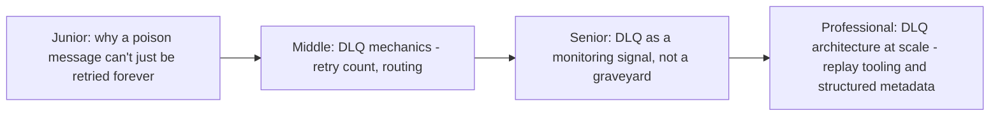
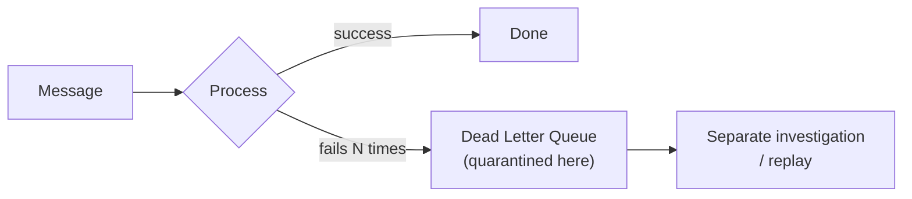

# Dead Letter Queues

> A dedicated holding area for messages that repeatedly fail processing —
> instead of blocking the main queue forever or silently dropping them, move
> them aside for separate investigation, keeping the main pipeline flowing.

## Choose a level

| Level | Guide | You are done when |
|---|---|---|
| Junior | [Why a poison message can't retry forever](junior.md) | You can explain why blocking a queue on one bad message hurts every other message behind it. |
| Middle | [DLQ mechanics](middle.md) | You can configure a retry-count-based DLQ routing policy. |
| Senior | [DLQ as a monitoring signal](senior.md) | You can explain why an unmonitored, ever-growing DLQ is itself a production risk. |
| Professional | [DLQ architecture at scale](professional.md) | You can design structured failure metadata and automated replay tooling for a production DLQ. |

## Practice rule

For any queue with a DLQ configured, ask: "who gets paged when the DLQ
grows, and how would they actually fix and replay those messages?" If the
answer is "nobody, it just sits there," you have a DLQ in name only — a
quiet graveyard of silently-failing work, not a monitored safety net.

## Related

- [Event-Driven Background Jobs — senior/professional](../../../distributed-system/17-background-jobs/event-driven/README.md)
- [Message Queues](../message-queues/README.md)
