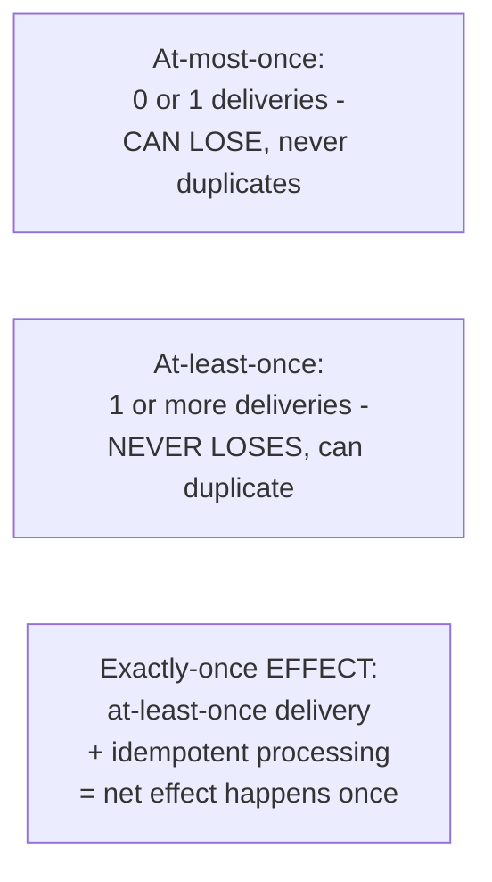

# Delivery Guarantees — Junior

<!-- level-focus -->
At junior level, focus on this question:

> What precisely does each of the three delivery guarantee levels promise?

---

## The three levels, defined precisely

| Guarantee | Promise | Never happens | Can happen |
|---|---|---|---|
| **At-most-once** | A message is delivered zero or one times | Duplicate delivery | Message loss |
| **At-least-once** | A message is delivered one or more times | Message loss | Duplicate delivery |
| **Exactly-once (effect)** | The *effect* of processing happens exactly once | Loss or duplicate *effect* | Duplicate delivery underneath, masked by idempotency |

## Why "exactly-once delivery" (not effect) isn't in this table

As covered in
[Exactly-Once Semantics — junior](../../../distributed-system/18-concurrency-coordination/exactly-once-semantics/junior.md),
true exactly-once **delivery** (the message physically arrives exactly
one time, guaranteed, over an unreliable network) is provably impossible —
what real systems provide, and what production documentation calls
"exactly-once," is always the third row: at-least-once delivery underneath,
combined with idempotent processing to produce an exactly-once **effect**.

> 🎓 **Takeaway:** memorize these three rows precisely. Most production
> incidents around "duplicate processing" or "we lost a message" trace
> back to someone assuming a system provided a stronger guarantee than it
> actually does — knowing the exact promise (and its exact failure mode)
> is the foundation for everything else in this topic.

## Test yourself

1. Which guarantee level would you choose for a "heartbeat/keep-alive"
   signal, and why is losing one occasionally acceptable there?
2. Which guarantee level would you choose for a financial transaction
   event, and why?
3. Why is "exactly-once delivery" different from "exactly-once effect,"
   and why does only the second one actually exist in real systems?

Continue to [`middle.md`](middle.md).
