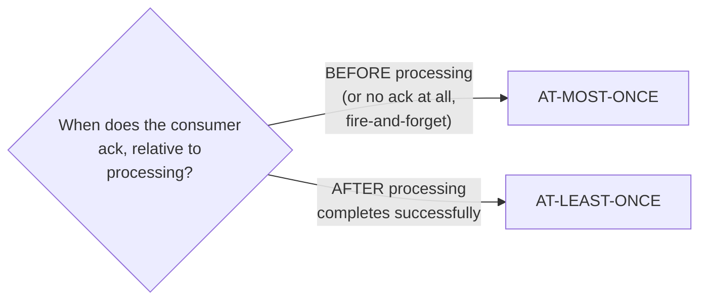
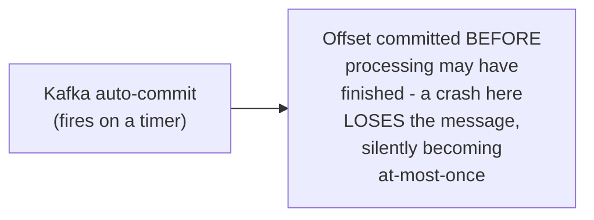

# Delivery Guarantees — Middle

<!-- level-focus -->
At middle level, focus on this question:

> Given a specific messaging system's documentation, how do you determine
> which guarantee it actually provides?

Prerequisite: [`junior.md`](junior.md).

---

## The diagnostic question: what happens at the ack boundary?

Per [Message Queues — senior](../message-queues/senior.md), the single
determining factor is **when acknowledgment happens relative to
processing**:

## A worked example: checking three real systems

| System | Default ack behavior | Guarantee |
|---|---|---|
| **UDP-based fire-and-forget logging** | No ack at all | At-most-once |
| **SQS standard queue, default consumer code** | Ack after processing (if implemented correctly) | At-least-once |
| **Kafka consumer with auto-commit enabled** | Offset committed on a timer, **not** necessarily after processing completes | Can silently become AT-MOST-ONCE if auto-commit fires before processing finishes and the consumer then crashes — a common, dangerous misconfiguration |

The Kafka example is the professional-level trap worth internalizing at
this level already: a system's **default configuration** can silently
provide a **weaker** guarantee than its marketing/documentation implies —
`enable.auto.commit=true` (Kafka's historical default) commits offsets on
a timer, decoupled from whether your handler actually finished processing,
meaning a crash between "offset committed" and "processing complete" loses
the message — the opposite of the at-least-once guarantee most engineers
assume Kafka provides by default.

> 🎓 **Takeaway:** never trust a system's guarantee based on its category
> ("it's Kafka, so it's at-least-once") — always trace the specific
> configuration's ack/commit timing relative to processing completion.
> The same underlying system can provide different guarantees depending
> entirely on this one configuration detail.

## Test yourself

1. Why can Kafka's auto-commit setting silently downgrade the delivery
   guarantee from at-least-once to at-most-once?
2. What specific configuration change would you make to ensure a Kafka
   consumer provides genuine at-least-once delivery?
3. For a messaging system you've used, trace through its actual ack/commit
   timing and determine which guarantee it truly provides.

Continue to [`senior.md`](senior.md).
