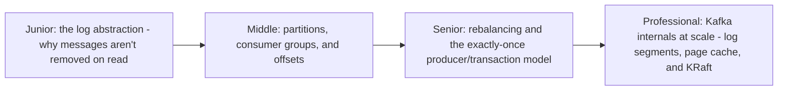
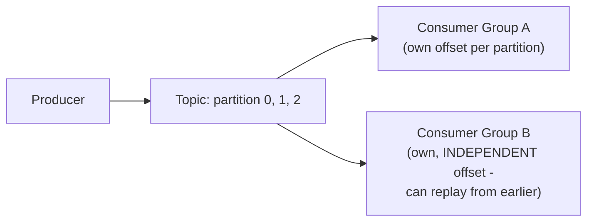

# Kafka

> A distributed, append-only, partitioned commit log — not a traditional
> message queue at all. Consumers track their own read position
> independently, messages aren't removed on consumption, and the same log
> can be replayed by any number of independent consumer groups. This
> structural difference from RabbitMQ/NATS is the key to everything else
> about how Kafka behaves.

## Choose a level

| Level | Guide | You are done when |
|---|---|---|
| Junior | [The log abstraction](junior.md) | You can explain why Kafka doesn't delete a message once it's been "consumed." |
| Middle | [Partitions, consumer groups, offsets](middle.md) | You can explain how partition count bounds consumer group parallelism. |
| Senior | [Rebalancing and transactions](senior.md) | You can explain what happens during a consumer group rebalance and how Kafka transactions provide exactly-once effect. |
| Professional | [Kafka internals at scale](professional.md) | You can explain log segments, the page-cache-based read/write path, and KRaft's replacement of ZooKeeper. |

## Practice rule

Before choosing Kafka for a new system, ask: "do I need multiple,
independent consumers to be able to replay the same data from different
historical points, or do I just need one consumer to process each message
once and move on?" The former is exactly Kafka's design point; the latter
is better served by a traditional queue (RabbitMQ, NATS).

## Related

- [Message Queues](../message-queues/README.md)
- [Leader Election — professional](../../distributed-system/consensus/leader-election/professional.md)
- [Exactly-Once Semantics](../../distributed-system/18-concurrency-coordination/exactly-once-semantics/README.md)
