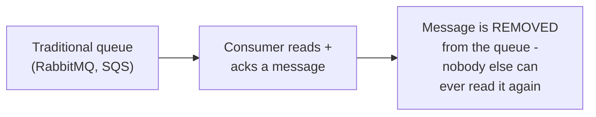
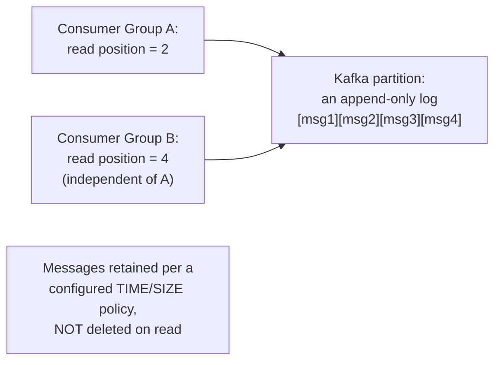

# Kafka — Junior

<!-- level-focus -->
At junior level, focus on this question:

> Why doesn't Kafka delete a message once a consumer has read it, unlike
> a traditional queue?

---

## A traditional queue: messages are removed on consumption

In [Message Queues](../16-asynchronism/01-message-queues/README.md), once
a message is consumed and acknowledged, it's gone — a second consumer
group wanting the same data would need a separate copy published to a
separate queue.

## Kafka: a log, not a queue — messages stay, readers track their own position

A Kafka **partition** is an append-only log — a message written to it
stays there (until it ages out per a configured retention policy, not
because someone "consumed" it). Each **consumer group** independently
tracks its own **offset** (read position) into the log — meaning multiple,
completely independent consumer groups can read the **same** data,
potentially from **different** positions, without any of them removing
or affecting what the others see.

> 🎓 **Takeaway:** Kafka's fundamental abstraction is a durable,
> replayable log — not a transient message queue. This single structural
> difference (log vs. queue) is the root cause of almost every other
> difference between Kafka and traditional brokers covered in this whole
> topic.

## Test yourself

1. Why can two independent consumer groups read the same Kafka topic at
   different "positions" simultaneously, without interfering with each
   other?
2. What determines when a message is actually removed from a Kafka
   partition, if not "being consumed"?
3. Why would a use case needing "replay the last 24 hours of events for a
   newly-deployed analytics consumer" be a natural fit for Kafka but
   awkward for a traditional queue?

Continue to [`middle.md`](middle.md).
