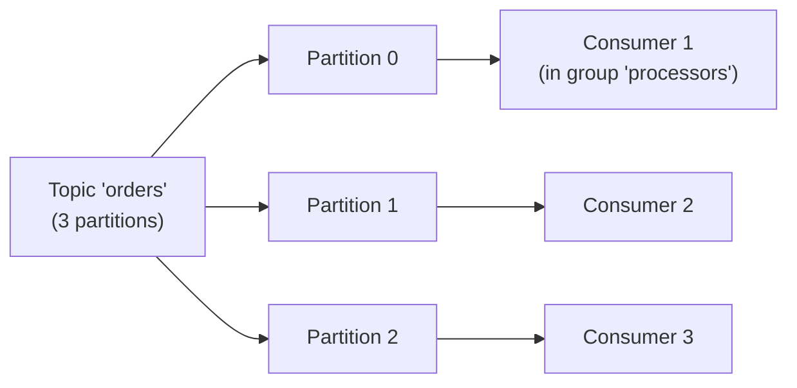
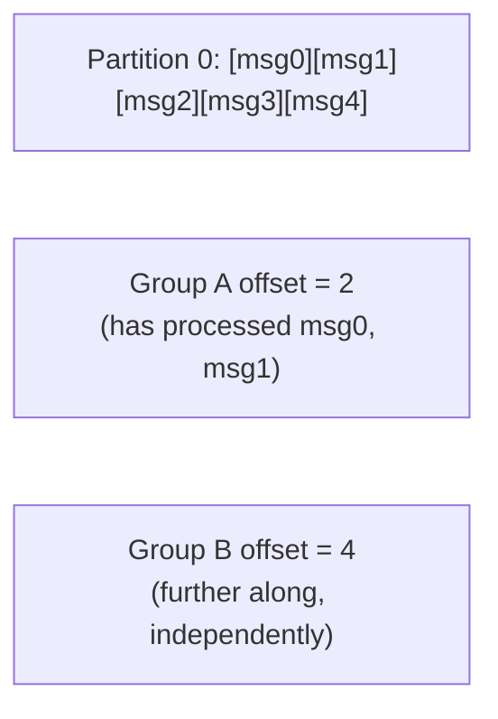

# Kafka — Middle

<!-- level-focus -->
At middle level, focus on this question:

> How does a topic's partition count bound how much a consumer group can
> parallelize, and how do offsets track progress?

Prerequisite: [`junior.md`](junior.md).

---

## Partitions: the unit of both ordering and parallelism



A topic is split into **partitions**, each an independent, ordered log.
Kafka guarantees ordering **within** a partition, never across partitions
(exactly the ordering-vs-parallelism trade-off from
[Event-Driven Background Jobs — senior](../../distributed-system/17-background-jobs/event-driven/senior.md)).
Within one consumer group, **each partition is assigned to exactly one
consumer instance** — meaning a topic with 3 partitions can have **at
most 3** consumer instances in one group doing useful work simultaneously;
a 4th instance would sit idle with no partition assigned.

```python
producer.send("orders", key=customer_id, value=order_data)
# key determines WHICH partition (via hash) - same customer_id
# always lands on the same partition, preserving per-customer order
```

## Offsets: each consumer group's independent bookmark



Each consumer group commits its own **offset** (the position of the next
message it will read) per partition — stored durably by Kafka itself
(in an internal topic, `__consumer_offsets`). This is what lets a
consumer resume exactly where it left off after a restart, and what makes
multiple independent consumer groups genuinely independent (`junior.md`).

> 🎓 **Takeaway:** partition count is your **parallelism ceiling** per
> consumer group — you cannot usefully run more consumer instances in one
> group than there are partitions. Choosing partition count is therefore
> a direct capacity-planning decision (see the Partitioning & Sharding
> professional page's identical principle), not an arbitrary default.

## Test yourself

1. If a topic has 6 partitions and a consumer group has 10 instances,
   what happens to the 4 "extra" instances?
2. Why does using `customer_id` as the partition key guarantee all of one
   customer's events are processed in order, even with multiple
   partitions?
3. Why is each consumer group's offset tracked independently, rather than
   Kafka tracking one global "read position" for a partition?

Continue to [`senior.md`](senior.md).
