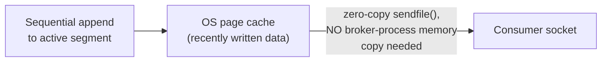
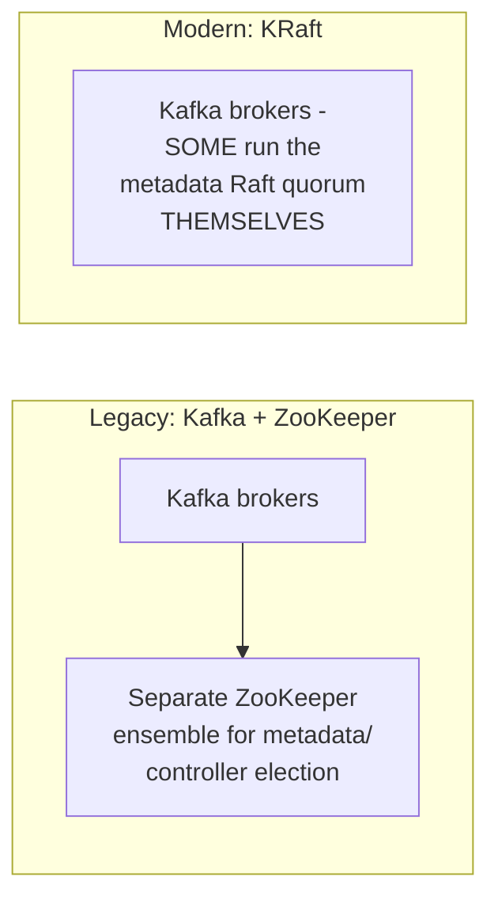

# Kafka — Professional

<!-- level-focus -->
At professional level, focus on this question:

> How does Kafka's log-segment storage and zero-copy read path deliver
> its famous throughput, and what did KRaft actually replace about
> ZooKeeper's role?

Prerequisite: [`senior.md`](senior.md).

---

## Log segments and the OS page cache: why Kafka is so fast

A Kafka partition's log is physically split into **segments** (files of a
configured max size) — writes are pure **sequential appends** to the
active segment (the same append-only-is-fast principle from the LSM-Tree
professional page, applied to Kafka's own storage), and old segments are
deleted wholesale once they age out of the retention window (fast, because
deleting a whole file is cheap; no per-message deletion bookkeeping is
ever needed).

Reads exploit the **OS page cache** aggressively: because writes are
sequential and reads are typically also sequential (a consumer reading
forward from its offset), the data a consumer needs is very often already
resident in the OS's page cache from the recent write — Kafka's broker
uses **zero-copy** transfer (`sendfile()` on Linux) to send this cached
data directly from the page cache to the network socket, **without**
copying it through the broker's own application memory/JVM heap at all —
a specific, deliberate systems-level optimization that's a major
contributor to Kafka's documented high throughput.



## KRaft: replacing ZooKeeper's coordination role with Kafka's own Raft

Historically, Kafka depended on **ZooKeeper** (per the Coordination
Services professional page) for cluster metadata and controller election.
**KRaft** (Kafka Raft, per KIP-500, referenced in the Leader Election
professional page) replaces this with a **built-in Raft-based metadata
quorum** — a subset of Kafka brokers themselves run the Raft protocol to
manage cluster metadata (partition assignments, broker membership, ACLs),
eliminating the need to operate a **separate** ZooKeeper ensemble
alongside the Kafka cluster entirely.



The professional-level operational benefit: one less distributed system
to operate, monitor, and reason about failure modes for — but KRaft's own
metadata-quorum brokers still face the exact same Raft election-timeout/
disk-latency sensitivity covered in the Raft and Leader Election
professional pages; KRaft removes an *entire separate coordination
system*, not the underlying consensus considerations themselves.

## Production checklist (staff-level)

1. **Size segment file size and retention policy against your actual
   replay/recovery requirements and disk capacity** — these directly
   determine both storage cost and how much history is available for a
   newly-deployed consumer group to replay.
2. **Monitor OS page cache hit rate for your Kafka brokers** as a leading
   indicator of read performance — a consumer significantly behind
   (reading old, evicted-from-cache data) forces disk reads instead of the
   fast page-cache/zero-copy path, a real, diagnosable performance
   degradation distinct from broker CPU/network saturation.
3. **Migrate to KRaft for new Kafka deployments** (ZooKeeper mode is being
   phased out across the Kafka ecosystem) — but understand this
   eliminates operating a separate system, not the underlying Raft
   election/disk-latency considerations from the Raft professional page.
4. **Design consumer group size and partition count together deliberately**
   (`middle.md`'s parallelism ceiling), accounting for rebalancing cost
   (`senior.md`) at your actual group size — larger groups mean more
   disruption per rebalance event.
5. **In a capacity-planning review for a new Kafka-based pipeline, model
   consumer lag against page-cache-resident data size explicitly** — a
   consumer falling behind by more data than fits in page cache
   transitions from fast cached reads to slow disk reads, a real
   performance cliff worth planning around.

## Cheat Sheet

```text
+------------------------------------------------------------------+
|                     KAFKA — INTERNALS & SCALE                       |
+------------------------------------------------------------------+
| Log segments: sequential append-only writes, whole-file deletion       |
| on retention expiry (cheap, no per-message bookkeeping)                |
| Reads: OS PAGE CACHE + ZERO-COPY (sendfile()) - data goes straight     |
| from page cache to network socket, NO broker-process memory copy -     |
| a major contributor to Kafka's documented high throughput              |
+------------------------------------------------------------------+
| Consumer significantly behind (lagging beyond page-cache-resident      |
| data) -> falls off the fast path onto slow DISK reads - a real,        |
| diagnosable performance cliff, distinct from CPU/network saturation    |
+------------------------------------------------------------------+
| KRaft (KIP-500): replaces ZooKeeper with a BUILT-IN Raft metadata       |
| quorum run by a subset of Kafka brokers themselves - eliminates          |
| operating a SEPARATE coordination system, but the underlying Raft       |
| election-timeout/disk-latency considerations (per the Raft/Leader       |
| Election professional pages) still apply to the quorum brokers          |
+------------------------------------------------------------------+
```

## Test yourself

1. Why does zero-copy (`sendfile()`) avoiding a broker-process memory copy
   matter specifically for Kafka's throughput, compared to a naive
   read-then-write-to-socket implementation?
2. Why does a consumer falling significantly behind cause a real
   performance cliff, not just a proportionally slower catch-up?
3. Explain what KRaft eliminates operationally, and what it does NOT
   eliminate (referencing the Raft professional page's considerations).

## Further Reading

- Kreps, Narkhede, Rao — "Kafka: a Distributed Messaging System for Log
  Processing" (the original Kafka paper, with the log-segment and
  zero-copy design rationale).
- Apache Kafka documentation — "KRaft" and "Consumer Group Rebalance
  Protocol" (cooperative rebalancing details).
- KIP-500 — "Replace ZooKeeper with a Self-Managed Metadata Quorum."
- See also: [LSM-Tree — professional](../../databases/performance/14-indexing%20%26%20filtering/lsm-tree/professional.md),
  [Raft — professional](../../distributed-system/consensus/raft/professional.md).
