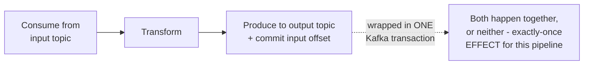

# Kafka — Senior

<!-- level-focus -->
At senior level, focus on this question:

> What happens during a consumer group rebalance, and how do Kafka
> transactions actually deliver exactly-once effect?

Prerequisite: [`middle.md`](middle.md).

---

## Rebalancing: reassigning partitions when group membership changes

```mermaid
sequenceDiagram
    participant C1 as Consumer 1
    participant C2 as Consumer 2
    participant C3 as New Consumer 3
    Note over C1,C2: C1 owns partitions 0,1; C2 owns partition 2
    C3->>C3: joins the group
    Note over C1,C2,C3: REBALANCE triggered:\nall consumers STOP processing,\npartitions reassigned
    Note over C1,C2,C3: New assignment: C1->0, C2->1, C3->2
    C1->>C1: resumes from committed offset
```

When a consumer joins or leaves a group (a new deployment, a crash, a
scale-up), Kafka triggers a **rebalance**: partitions are reassigned
across the current set of consumers. During a rebalance (in the classic
"stop-the-world" protocol), **every** consumer in the group briefly stops
processing — this is a real, measurable pause in throughput that scales
with group size and is a well-known operational consideration; modern
Kafka's **cooperative rebalancing** protocol reduces this by reassigning
only the specific partitions that need to move, rather than revoking and
reassigning everything.

## Kafka transactions: exactly-once effect for consume-transform-produce

Recall from
[Exactly-Once Semantics — professional](../../distributed-system/18-concurrency-coordination/exactly-once-semantics/professional.md):
Kafka's idempotent producer (deduplicating retried sends via a
per-partition sequence number) and **transactions** (atomically
committing both a produce to an output topic AND a consumer offset commit)
together give a consume-transform-produce pipeline genuine exactly-once
**effect** — this is the mechanism that lets you build a Kafka Streams
application (or any consumer-then-producer pipeline) that behaves as if
each input record were processed exactly once, even though the underlying
delivery is still at-least-once.



> 🎯 **Senior takeaway:** rebalancing is a real, measurable operational
> cost you should design around (minimize unnecessary consumer restarts,
> use cooperative rebalancing, size groups deliberately) — and Kafka's
> "exactly-once" is precisely the professional-level pattern from the
> Exactly-Once Semantics topic (idempotent producer + transactions),
> applied natively within Kafka's own ecosystem.

## Test yourself

1. Why does a rebalance require pausing processing across the **entire**
   group, not just the consumer whose assignment is changing?
2. Why does cooperative rebalancing reduce disruption compared to the
   classic stop-the-world protocol?
3. Explain how wrapping a produce-and-offset-commit in one Kafka
   transaction achieves exactly-once effect for a consume-transform-produce
   pipeline.

Continue to [`professional.md`](professional.md) to see Kafka's internal
storage/read-path architecture and KRaft at scale.
