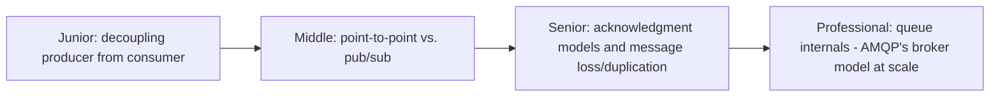
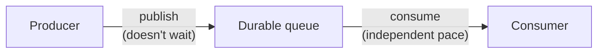

# Message Queues

> Decouple a producer from a consumer with a durable buffer in between —
> the producer doesn't wait for the consumer to be ready, and the consumer
> doesn't need the producer to still be alive. The foundational building
> block underneath task queues, event streaming, and most async
> architectures.

## Choose a level

| Level | Guide | You are done when |
|---|---|---|
| Junior | [Decoupling producer from consumer](junior.md) | You can explain why a direct call couples producer and consumer availability together. |
| Middle | [Point-to-point vs. pub/sub](middle.md) | You can choose between a queue (one consumer per message) and a topic (many consumers per message). |
| Senior | [Acknowledgment models](senior.md) | You can explain how ack timing determines at-least-once vs. at-most-once delivery. |
| Professional | [AMQP broker internals](professional.md) | You can explain how a broker like RabbitMQ actually routes and stores messages at scale. |

## Practice rule

Before connecting two services directly (a synchronous HTTP call), ask:
"does the caller genuinely need an immediate response, or would it be fine
if the work happened moments later?" If the latter, a message queue
decouples their availability and load characteristics from each other.

## Related

- [Task Queues](../task-queues/README.md)
- [Delivery Guarantees](../delivery-guarantees/README.md)
- [Event-Driven Background Jobs](../../../distributed-system/17-background-jobs/event-driven/README.md)
