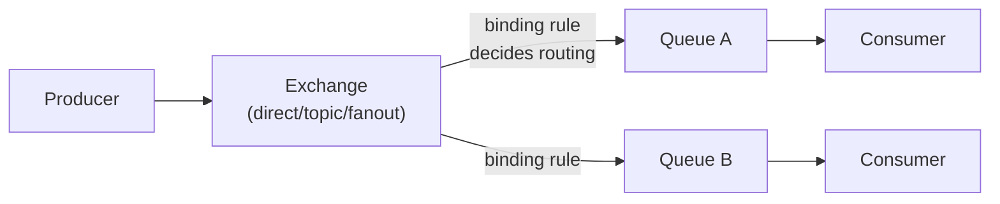
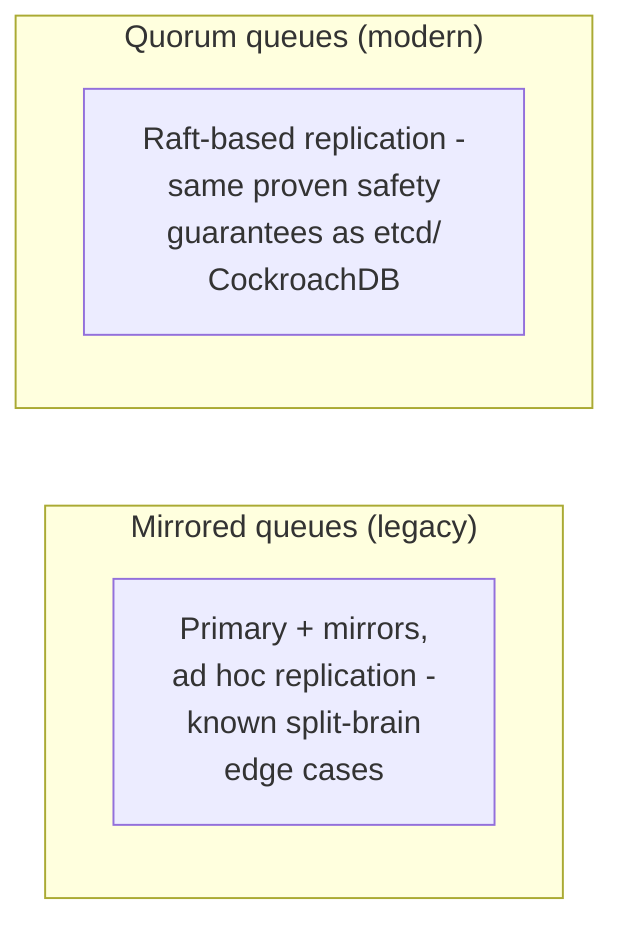

# Message Queues — Professional

<!-- level-focus -->
At professional level, focus on this question:

> How does an AMQP broker (RabbitMQ) actually route and store messages
> internally, and what real production limits does this architecture
> impose at scale?

Prerequisite: [`senior.md`](senior.md).

---

## AMQP's exchange-binding-queue model

AMQP (the protocol RabbitMQ implements) separates routing logic from
storage explicitly: a producer publishes to an **exchange** (never
directly to a queue); the exchange applies a **binding** rule (direct,
topic-pattern, or fanout-to-everyone) to decide which **queue(s)** receive
a copy; consumers only ever read from queues. This decoupling is what
enables `middle.md`'s point-to-point vs. pub/sub distinction to be
implemented via configuration (exchange type) rather than different
underlying protocols.



## Queue storage: memory vs. disk, and the classic mirroring trade-off

RabbitMQ queues can be configured to keep messages **in memory** (fast,
but lost on broker crash unless durability is separately configured) or
**persisted to disk** (durable, survives a crash, at real write-latency
cost per message — echoing the exact durability-vs-throughput trade-off
from the Transactions & ACID professional page's `fsync` discussion,
applied to a message broker instead of a database). Production RabbitMQ
deployments requiring high availability historically used **mirrored
queues** (later replaced by the more Raft-based **quorum queues** in
modern RabbitMQ) — quorum queues specifically apply the Raft consensus
protocol (see the Raft professional page) to message replication,
directly trading the older mirrored-queue design's known split-brain and
data-loss edge cases for Raft's proven safety guarantees.



## The real scaling limit: per-queue single-active-consumer ordering

A classic AMQP queue, when strict message ordering matters, is
fundamentally processed by a **single active consumer** at a time for
that ordering guarantee to hold (similar to the per-partition ordering
constraint from the Event-Driven Background Jobs professional page) — this
is a real throughput ceiling for any single queue requiring strict order,
and production systems needing both high throughput and ordering
typically **shard** work across multiple queues (partitioned by a key,
exactly the pattern covered in the Partitioning & Sharding professional
page), accepting ordering only **within** each shard's queue, not globally.

## Production checklist (staff-level)

1. **Choose message durability (in-memory vs. disk-persisted) deliberately
   per queue**, based on the actual cost of losing that queue's messages
   on a broker crash — don't default to maximum durability everywhere at
   the cost of unnecessary write latency for genuinely disposable
   messages.
2. **Use quorum queues (Raft-based) rather than legacy mirrored queues**
   for any production RabbitMQ deployment requiring high availability —
   the older mirroring approach has documented split-brain risk that
   quorum queues' Raft foundation directly addresses.
3. **Shard high-throughput, order-sensitive work across multiple queues**
   (partitioned by a key) rather than expecting a single queue to provide
   both high throughput and strict ordering — these two properties are in
   direct tension for a single queue.
4. **Choose exchange type deliberately** (direct, topic, fanout) based on
   your actual routing requirement, understanding it's the mechanism
   implementing `middle.md`'s point-to-point/pub-sub distinction under the
   hood.
5. **In a capacity-planning review for a RabbitMQ-based system, model
   both per-queue throughput ceilings (from the ordering constraint above)
   and disk I/O cost from persisted-message durability settings** as
   distinct, separately-tunable scaling dimensions.

## Cheat Sheet

```text
+------------------------------------------------------------------+
|                MESSAGE QUEUES — INTERNALS & SCALE                   |
+------------------------------------------------------------------+
| AMQP model: producer -> EXCHANGE (routing logic) -> binding rule ->    |
| QUEUE(s) (storage) -> consumer. Exchange type (direct/topic/fanout)    |
| implements point-to-point vs. pub/sub as CONFIGURATION                |
+------------------------------------------------------------------+
| Queue durability: in-memory (fast, lost on crash) vs. disk-persisted  |
| (durable, real per-message write-latency cost) - same fsync           |
| trade-off as database durability, applied to a broker                 |
+------------------------------------------------------------------+
| Modern RabbitMQ: QUORUM QUEUES (Raft-based replication) replace         |
| legacy mirrored queues' ad hoc replication and known split-brain        |
| edge cases with proven Raft safety guarantees                          |
+------------------------------------------------------------------+
| Strict ordering requires a SINGLE active consumer per queue - a real   |
| throughput ceiling. Shard order-sensitive, high-throughput work         |
| across multiple queues (partitioned by key) for ordering-within-       |
| shard, not global ordering                                             |
+------------------------------------------------------------------+
```

## Test yourself

1. Why does AMQP separate "exchange" (routing) from "queue" (storage), and
   how does this separation implement both queue and topic semantics
   using the same underlying protocol?
2. Why do quorum queues' Raft foundation address split-brain risks that
   legacy mirrored queues had?
3. Design a sharding strategy for a high-throughput, per-customer-ordered
   event stream using multiple RabbitMQ queues.

## Further Reading

- AMQP 0-9-1 specification — exchanges, bindings, queues.
- RabbitMQ documentation — "Quorum Queues" (Raft-based replication) and
  "Reliability Guide."
- See also: [Raft — professional](../../../distributed-system/consensus/raft/professional.md),
  [Transactions & ACID — professional](../../../databases/transaction/transactions-and-acid/professional.md).
