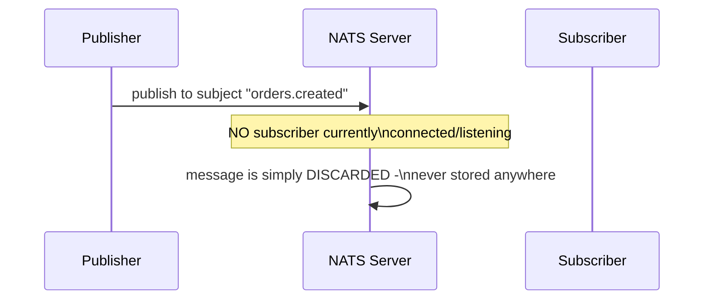
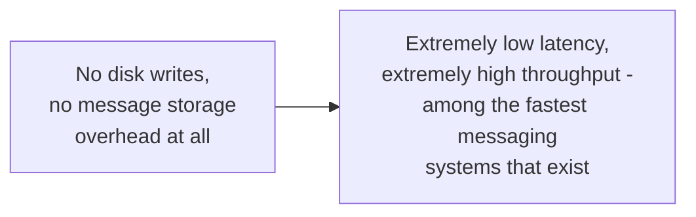

# NATS — Junior

<!-- level-focus -->
At junior level, focus on this question:

> Why is Core NATS deliberately at-most-once, with no message persistence
> at all, and why would anyone want that?

---

## Core NATS: fire-and-forget, by design



Core NATS does not persist messages at all — if no subscriber is actively
connected and listening on a subject at the moment a message is
published, that message is **gone**, permanently. This is the at-most-once
guarantee from [Delivery Guarantees — junior](../delivery-guarantees/junior.md),
chosen **deliberately**, not as a limitation to work around.

```python
import asyncio
from nats.aio.client import Client as NATS

async def main():
    nc = NATS()
    await nc.connect("nats://localhost:4222")
    await nc.publish("orders.created", b"order data")
    await nc.close()
```

## Why this trade-off is valuable



By not persisting anything, Core NATS avoids all the durability-related
costs covered throughout this tree (WAL writes, replication, disk I/O) —
making it exceptionally fast and simple, ideal for use cases where
messages are genuinely transient and losing one is truly fine: real-time
status updates that will simply be superseded by the next update anyway,
service discovery heartbeats, or ephemeral request/reply patterns where a
timeout naturally handles the "nobody was listening" case.

> 🎓 **Takeaway:** Core NATS's lack of persistence isn't a missing
> feature — it's the deliberate design choice that makes it extremely
> fast, targeted specifically at use cases where at-most-once is
> genuinely the right guarantee (per the Delivery Guarantees professional
> page's data-classification framing), not a universal messaging
> solution.

## Test yourself

1. Why does NOT persisting messages make Core NATS faster than a
   persistent broker like RabbitMQ or Kafka?
2. Give an example of a real message type where losing it (because no
   subscriber was listening) would be genuinely acceptable.
3. Why would Core NATS be a poor choice for an order-processing pipeline
   where losing an order event is unacceptable?

Continue to [`middle.md`](middle.md).
