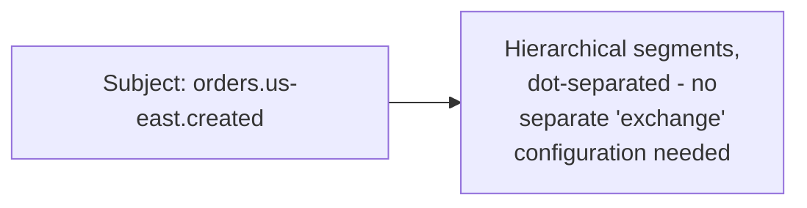
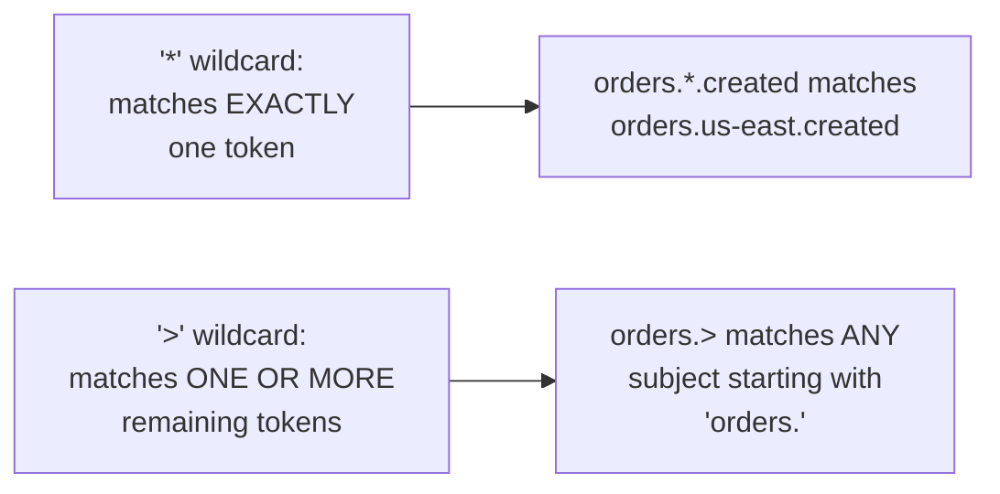

# NATS — Middle

<!-- level-focus -->
At middle level, focus on this question:

> How do subjects and wildcard subscriptions let you design flexible
> routing without RabbitMQ-style exchange configuration?

Prerequisite: [`junior.md`](junior.md).

---

## Subjects: hierarchical, dot-separated strings



Unlike RabbitMQ's exchange/binding model (per
[RabbitMQ — middle](../rabbitmq/middle.md)), NATS has no separate
routing configuration step — publishers just publish directly to a
**subject** string, and subscribers subscribe to subjects (or wildcard
patterns) directly. Routing is entirely implicit in the subject naming
convention itself.

## Wildcards: `*` (one token) and `>` (rest of the subject)

```python
await nc.subscribe("orders.*.created", cb=handle_regional_order)
# matches: orders.us-east.created, orders.eu-west.created
# does NOT match: orders.us-east.shipping.created (too many segments)

await nc.subscribe("orders.>", cb=handle_all_order_events)
# matches: orders.created, orders.us-east.created,
#          orders.us-east.shipping.created (ANY depth)
```



> 🎓 **Takeaway:** NATS trades RabbitMQ's explicit exchange/binding
> configuration for an implicit, convention-based subject hierarchy —
> simpler to reason about for straightforward hierarchical routing, at
> the cost of the more sophisticated matching (headers-based routing, for
> example) that RabbitMQ's exchange types provide.

## Test yourself

1. Does `orders.*` match `orders.us-east.created`? Why or why not, based
   on what `*` matches?
2. Design a subject naming scheme for a system with events for orders,
   users, and inventory, each needing per-region routing.
3. Why might NATS's implicit subject-based routing be simpler to reason
   about than RabbitMQ's explicit exchange/binding configuration for a
   straightforward hierarchical use case?

Continue to [`senior.md`](senior.md).
