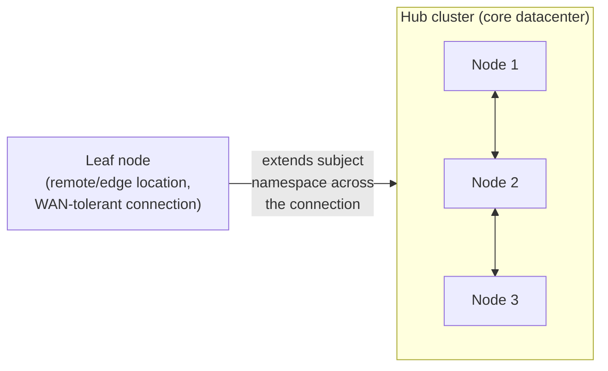
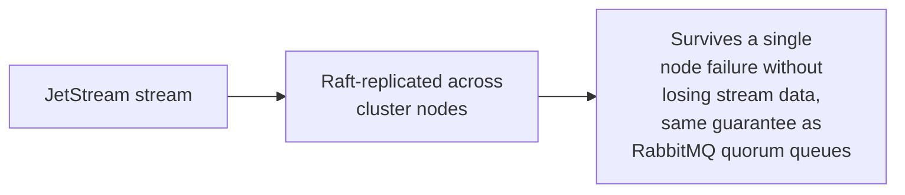

# NATS — Professional

<!-- level-focus -->
At professional level, focus on this question:

> How does NATS's leaf node topology let you build a multi-region
> deployment differently from RabbitMQ's clustering/federation split, and
> how does JetStream's clustering provide Raft-based durability?

Prerequisite: [`senior.md`](senior.md).

---

## Leaf nodes: a third topology option, between clustering and federation

NATS offers **leaf nodes** as a distinct connectivity pattern: a leaf node
is a NATS server that connects to a remote "hub" cluster and
**extends** the subject namespace across the connection — messages
published on the leaf can reach subscribers on the hub (and vice versa)
without the leaf node needing to be a full member of the hub's cluster
(no shared Raft consensus, no requirement for LAN-quality latency between
leaf and hub). This sits conceptually between RabbitMQ's tightly-coupled
clustering and its WAN-tolerant federation (per
[RabbitMQ — professional](../rabbitmq/professional.md)) — leaf nodes
are specifically designed to let edge locations (a remote office, an IoT
gateway, a satellite datacenter with a less reliable link back to the
core) participate in the same logical messaging namespace without paying
clustering's tight-coupling cost.



## JetStream clustering: Raft-replicated streams

JetStream itself, when run in a clustered NATS deployment, replicates
stream data using **Raft** (per the Raft professional page) across
cluster nodes — giving JetStream streams the same node-failure tolerance
that quorum queues provide in RabbitMQ (per
[RabbitMQ — senior](../rabbitmq/senior.md)), via the identical
underlying consensus mechanism, just implemented within NATS's own
architecture rather than RabbitMQ's.



## Production checklist (staff-level)

1. **Use leaf nodes for edge/remote locations needing to participate in
   the messaging namespace over an unreliable or high-latency link**,
   rather than attempting full clustering (which assumes LAN-quality
   connectivity, per the RabbitMQ professional page's identical
   constraint).
2. **Enable JetStream clustering (Raft-replicated streams) for any
   durable stream requiring node-failure tolerance**, understanding the
   same replication-latency cost trade-off as RabbitMQ's quorum queues.
3. **Choose Core NATS vs. JetStream per subject deliberately** (`senior.md`),
   and document the choice as part of your data-classification policy
   (per the Delivery Guarantees professional page), not as an
   unconsidered default.
4. **Design leaf-node topology around actual network reliability
   boundaries** — the same geographic/network-quality reasoning from the
   Deployment Stamps professional page applies directly to choosing
   between full clustering and leaf-node connectivity.
5. **In an architecture review for a multi-region NATS deployment,
   require an explicit topology diagram distinguishing hub-cluster
   (tightly-coupled) from leaf-node (loosely-coupled, WAN-tolerant)
   connections** — the same discipline recommended for RabbitMQ's
   cluster/federation distinction, adapted to NATS's specific
   leaf-node mechanism.

## Cheat Sheet

```text
+------------------------------------------------------------------+
|                      NATS — INTERNALS & SCALE                       |
+------------------------------------------------------------------+
| Core NATS: no persistence, at-most-once, extremely fast - a           |
| DELIBERATE design choice for genuinely transient message types         |
| JetStream: OPT-IN persistence layer (streams + consumers with ack) -  |
| at-least-once, coexists alongside Core NATS in the same deployment,   |
| chosen PER SUBJECT based on the actual guarantee needed                |
+------------------------------------------------------------------+
| Leaf nodes: a THIRD topology option (between RabbitMQ's clustering     |
| and federation) - extends the subject namespace to edge/remote        |
| locations over unreliable/high-latency links WITHOUT requiring full   |
| cluster membership (no shared Raft, no LAN-quality latency needed)     |
+------------------------------------------------------------------+
| JetStream clustering: Raft-replicated streams - same node-failure      |
| tolerance guarantee as RabbitMQ quorum queues, via the identical       |
| underlying consensus mechanism, implemented within NATS's own          |
| architecture                                                          |
+------------------------------------------------------------------+
```

## Test yourself

1. Why are leaf nodes better suited than full clustering for connecting a
   remote edge location with an unreliable network link back to the core
   datacenter?
2. Why does JetStream clustering's Raft-based replication provide the
   same category of guarantee as RabbitMQ's quorum queues, despite being
   implemented in a completely different messaging system?
3. Design the topology (hub cluster + leaf nodes) for a company with a
   central datacenter and 20 retail store locations, each needing to
   publish local events to the central system reliably despite
   store-location network unreliability.

## Further Reading

- NATS documentation — "JetStream" and "Leaf Nodes" (the specific
  architecture concepts referenced above).
- See also: [RabbitMQ — professional](../rabbitmq/professional.md),
  [Raft — professional](../../../distributed-system/consensus/raft/professional.md).
