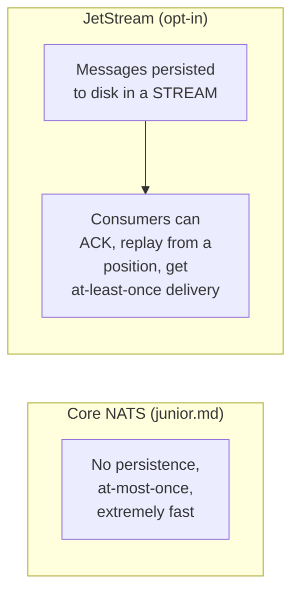
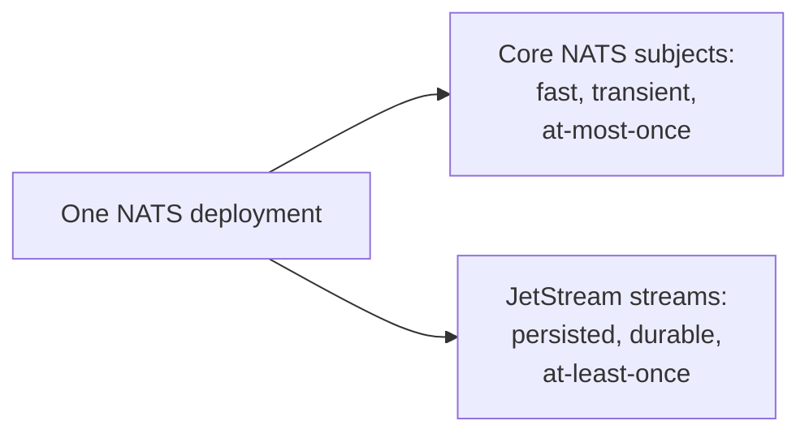

# NATS — Senior

<!-- level-focus -->
At senior level, focus on this question:

> What does JetStream actually add on top of Core NATS, and how does it
> change the delivery guarantee?

Prerequisite: [`middle.md`](middle.md).

---

## JetStream: an opt-in persistence layer



```python
js = nc.jetstream()

# Create a durable stream capturing messages on matching subjects
await js.add_stream(name="ORDERS", subjects=["orders.>"])

# Consumer with explicit ack - now genuinely at-least-once
sub = await js.pull_subscribe("orders.created", "order_processor")
msgs = await sub.fetch(10)
for msg in msgs:
    process(msg.data)
    await msg.ack()   # explicit ack, after processing - at-least-once
```

JetStream introduces **streams** (durable, persisted logs of messages on
matching subjects — conceptually similar to a Kafka topic, per the
sibling Kafka topic) and **consumers** (tracked read positions with
explicit acknowledgment) — giving you the same at-least-once delivery
discipline from [Delivery Guarantees — middle](../delivery-guarantees/middle.md),
but as an **explicit opt-in** per stream, rather than Core NATS's
universal at-most-once default.

## The trade-off: you choose durability per subject, not globally



A single NATS deployment can serve **both** Core NATS (fast, transient)
and JetStream (durable, replayable) traffic simultaneously — you choose,
per subject/use case, whether the added persistence cost is worth the
stronger guarantee, directly implementing the Delivery Guarantees
professional page's "classify data, choose guarantee per class"
principle within one messaging system's configuration, rather than
needing two separate messaging technologies.

> 🎯 **Senior takeaway:** JetStream doesn't replace Core NATS's speed —
> it coexists alongside it, letting you pay the persistence cost
> selectively, exactly where the guarantee matters, while keeping
> genuinely transient traffic on the fast, unpersisted Core NATS path.

## Test yourself

1. Why can a single NATS deployment serve both at-most-once (Core) and
   at-least-once (JetStream) traffic simultaneously, rather than needing
   to pick one guarantee for the whole system?
2. What specifically changes in the consumer code when moving from Core
   NATS subscription to a JetStream pull consumer?
3. Design which subjects in an e-commerce system would use Core NATS
   versus JetStream, and justify each choice.

Continue to [`professional.md`](professional.md) to design clustered,
multi-region NATS topology using leaf nodes.
