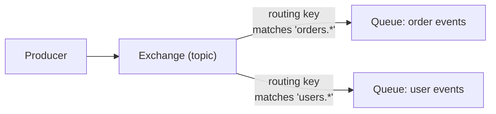

# RabbitMQ

> A mature, general-purpose AMQP message broker with flexible routing
> (exchanges and bindings) — the go-to choice when you need sophisticated
> routing logic, not just a firehose of ordered events (that's Kafka's
> job — see the sibling NATS and Kafka topics for the contrast).

## Choose a level

| Level | Guide | You are done when |
|---|---|---|
| Junior | [Exchanges, bindings, queues](junior.md) | You can declare an exchange, bind a queue to it, and publish/consume a message. |
| Middle | [Routing patterns](middle.md) | You can choose between direct, topic, fanout, and headers exchange types for a given use case. |
| Senior | [Clustering and queue placement](senior.md) | You can explain where a classic-mirrored/quorum queue's data actually lives in a cluster. |
| Professional | [RabbitMQ at scale](professional.md) | You can design a federated or clustered multi-datacenter RabbitMQ topology. |

## Practice rule

Before choosing RabbitMQ over Kafka (or vice versa) for a new system, ask:
"do I need flexible, content-based routing to many different consumers
(RabbitMQ's strength), or do I need a durable, replayable, ordered log
that many independent consumer groups can read at their own pace and
their own historical position (Kafka's strength)?"

## Related

- [Message Queues](../message-queues/README.md)
- [Kafka](../../kafka/README.md)
