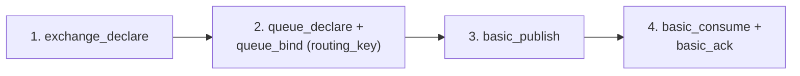

# RabbitMQ — Junior

<!-- level-focus -->
At junior level, focus on this question:

> How do you actually declare an exchange, bind a queue, and publish/
> consume a message in RabbitMQ?

---

## The three-step setup

```python
import pika

connection = pika.BlockingConnection(pika.ConnectionParameters("localhost"))
channel = connection.channel()

# 1. Declare an exchange
channel.exchange_declare(exchange="orders", exchange_type="direct")

# 2. Declare a queue and BIND it to the exchange
channel.queue_declare(queue="order_processing")
channel.queue_bind(exchange="orders", queue="order_processing", routing_key="new_order")

# 3. Publish
channel.basic_publish(exchange="orders", routing_key="new_order", body="order_data")

# Consume
def callback(ch, method, properties, body):
    print(f"Received: {body}")
    ch.basic_ack(delivery_tag=method.delivery_tag)

channel.basic_consume(queue="order_processing", on_message_callback=callback)
channel.start_consuming()
```



This is the concrete implementation of the AMQP model from
[Message Queues — professional](../message-queues/professional.md):
the exchange is where you publish, the binding is the routing rule, the
queue is where the consumer actually reads from, and `basic_ack` is the
explicit acknowledgment (recall the at-least-once discipline from
[Delivery Guarantees](../delivery-guarantees/README.md) — ack **after**
processing, as shown here, not before).

> 🎓 **Takeaway:** RabbitMQ's API directly mirrors AMQP's exchange-
> binding-queue model — nothing here is RabbitMQ-specific magic, it's a
> concrete implementation of the protocol concepts covered in the
> Message Queues topic.

## Test yourself

1. What would happen if you called `basic_publish` to an exchange with a
   routing key that no queue is bound to match?
2. Why does the callback call `basic_ack` at the end, rather than at the
   start of processing?
3. What's the difference between `queue_declare` and `queue_bind` — why
   are these two separate steps?

Continue to [`middle.md`](middle.md).
