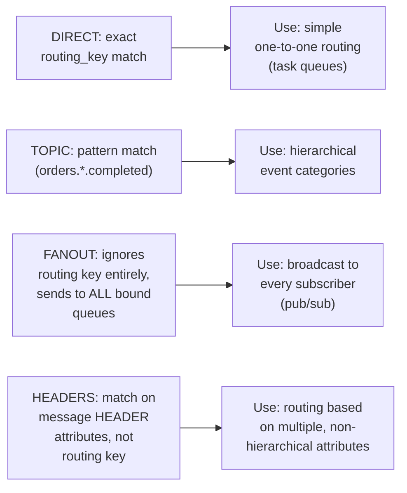

# RabbitMQ — Middle

<!-- level-focus -->
At middle level, focus on this question:

> How do you choose between direct, topic, fanout, and headers exchange
> types for a given routing requirement?

Prerequisite: [`junior.md`](junior.md).

---

## The four exchange types



```python
# Topic exchange: pattern-based routing
channel.exchange_declare(exchange="events", exchange_type="topic")
channel.queue_bind(exchange="events", queue="order_events", routing_key="orders.*")
channel.queue_bind(exchange="events", queue="all_completed", routing_key="*.completed")

# A message published with routing_key="orders.completed" matches BOTH bindings
```

- **Direct**: exact string match on routing key — the simplest, most
  predictable routing, ideal for classic queue/worker-pool patterns.
- **Topic**: wildcard pattern matching (`*` for one segment, `#` for
  zero-or-more) — ideal for hierarchical event categorization
  (`orders.created`, `orders.completed`, `users.signup`).
- **Fanout**: ignores the routing key entirely, delivers to **every**
  bound queue — the direct implementation of pub/sub broadcast from
  [Message Queues — middle](../message-queues/middle.md).
- **Headers**: matches on arbitrary message header key-value pairs instead
  of a single routing key string — useful when routing depends on
  multiple independent attributes that don't naturally form a hierarchy.

> 🎓 **Takeaway:** exchange type is the single configuration choice that
> determines your routing semantics — pick based on whether you need
> exact matching, hierarchical pattern matching, broadcast-to-everyone,
> or multi-attribute matching, not by defaulting to whichever type you
> used last time.

## Test yourself

1. Why would a topic exchange with routing key `orders.*.completed` NOT
   match a message published with routing key `orders.completed` (missing
   the middle segment)? (Hint: think about what `*` matches versus `#`.)
2. Why is fanout the right choice for "notify every subscriber of this
   event," rather than direct or topic?
3. Design the exchange type and routing key scheme for a system that
   needs to route messages based on both "region" and "priority"
   independently.

Continue to [`senior.md`](senior.md).
