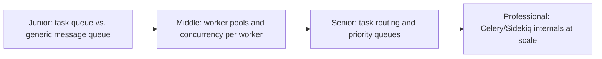
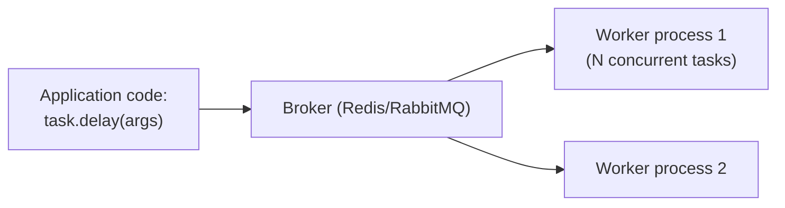

# Task Queues

> A message queue specialized for one purpose: distributing units of
> executable work (not just data) across a pool of workers — with built-in
> support for retries, scheduling, and result tracking that a generic
> message queue doesn't provide out of the box.

## Choose a level

| Level | Guide | You are done when |
|---|---|---|
| Junior | [Task queue vs. generic message queue](junior.md) | You can explain what a task queue framework adds on top of a raw broker. |
| Middle | [Worker pools and concurrency](middle.md) | You can size a worker pool for a given task type and volume. |
| Senior | [Task routing and priority](senior.md) | You can design routing so critical tasks aren't stuck behind low-priority ones. |
| Professional | [Celery/Sidekiq internals](professional.md) | You can diagnose a task queue's real production bottlenecks (broker, worker concurrency model, result backend). |

## Practice rule

Before building a custom "run this function later" mechanism on a raw
message queue, check whether a task queue framework (Celery, Sidekiq, BullMQ)
already provides the retry, scheduling, and result-tracking machinery you'd
otherwise reimplement — this is almost always the case.

## Related

- [Message Queues](../message-queues/README.md)
- [Retries & Idempotency](../../../schedule-jobs/retries-and-idempotency/README.md)
- [Returning Results from Background Jobs](../../../schedule-jobs/returning-results/README.md)
