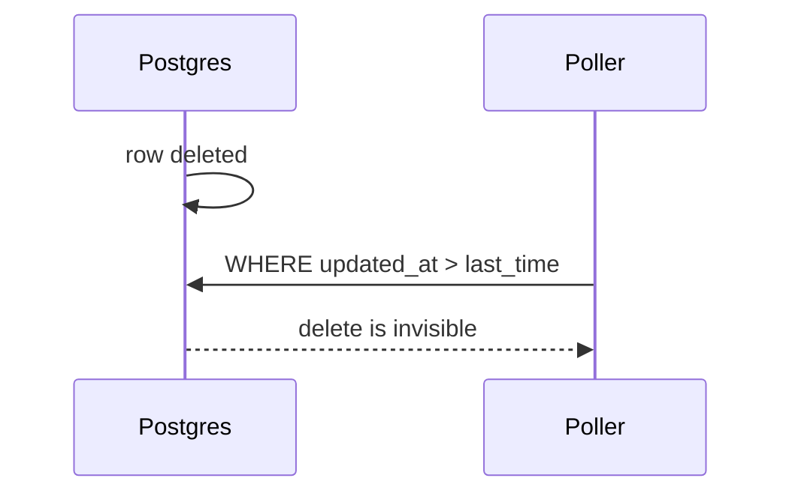

# CDC Pipeline - Junior
Polling `updated_at` can miss deletes, race concurrent updates, and load the primary. CDC reads the database's ordered commit log instead.

Debezium converts WAL records into insert, update, and delete events for search, cache, and warehouse consumers. The hard transition is loading existing rows while new writes continue.
## Test yourself
1. Why can timestamp polling miss deletes?
2. What truth does the WAL contain?
3. Why is an initial snapshot needed?
Continue to [`middle.md`](middle.md).
