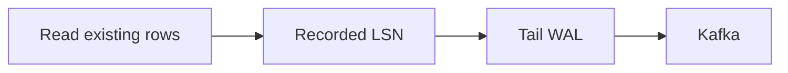

# CDC Pipeline - Middle
CDC takes a consistent snapshot, records its log position, then continues from that position without a gap.

A Postgres replication slot retains WAL until Debezium confirms progress. Key Kafka records by primary key for per-row order. The sink stores source position/version with each effect so redelivery is harmless. `REPLICA IDENTITY` determines what UPDATE and DELETE contain.
## Test yourself
1. What connects snapshot and stream?
2. Why key events by primary key?
3. What does a replication slot retain?
Continue to [`senior.md`](senior.md).
