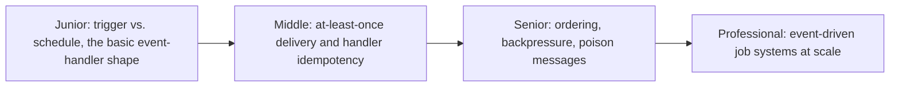
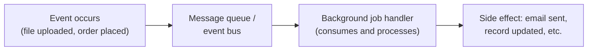

# Event-Driven Background Jobs

> Trigger work in response to something happening, not on a fixed schedule.
> A file lands in storage, an order is placed, a message arrives — and a
> handler runs. The most common shape for background work in a modern
> distributed system.

## Choose a level

| Level | Guide | You are done when |
|---|---|---|
| Junior | [Trigger vs. schedule](junior.md) | You can explain when event-driven jobs are the right shape versus a fixed schedule. |
| Middle | [At-least-once delivery](middle.md) | You can explain why a handler might run twice for one event, and what that requires of your handler. |
| Senior | [Ordering and poison messages](senior.md) | You can explain what happens when one bad message blocks a queue, and how ordering guarantees interact with parallelism. |
| Professional | [Event-driven systems at scale](professional.md) | You can design a production event-driven job system's failure handling, backpressure, and observability. |

## Practice rule

For any event-driven handler you write, ask: "if this exact event were
delivered twice, in a row, right now — what happens?" If the answer isn't
"nothing bad," the handler isn't safe for at-least-once delivery, which is
what almost every real message queue provides.

## Related

- [Schedule-Driven Background Jobs](../../../schedule-jobs/02-schedule-driven/README.md)
- [Retries & Idempotency](../../../schedule-jobs/04-retries-and-idempotency/README.md)
- [Delivery Guarantees](../../asynchronism/05-delivery-guarantees/README.md)
