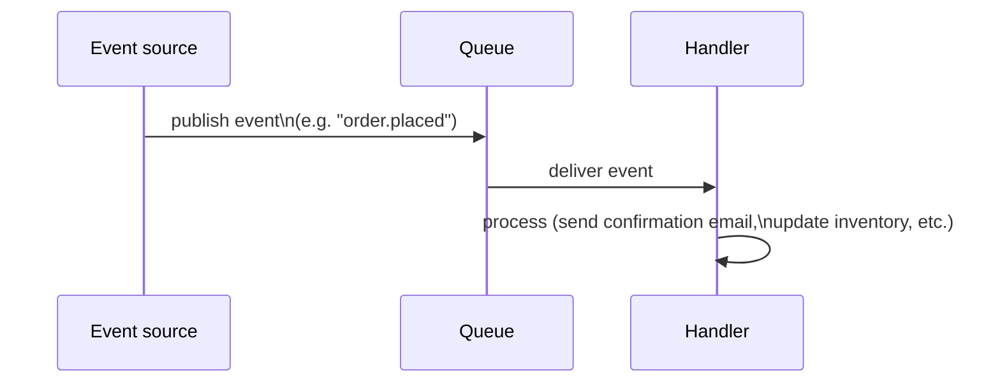

# Event-Driven Background Jobs — Junior

<!-- level-focus -->
At junior level, focus on this question:

> When should work be triggered by an event, rather than run on a fixed
> schedule?

---

## The basic shape

An **event-driven** background job runs in direct response to something
happening — a file uploaded to object storage, a row inserted into a
database (via CDC), a message published to a queue, a webhook received from
a third party. The job's timing is entirely determined by **when the event
occurs**, not by a clock.

## Event-driven vs. schedule-driven

| | Event-driven | Schedule-driven |
|---|---|---|
| Trigger | Something happened | A point in time arrived |
| Latency | Near-immediate reaction to the event | Bounded by the schedule interval, even if the underlying need arose earlier |
| Example | Send a welcome email the moment a user signs up | Generate a daily sales report at 2am |
| Idle cost | Zero work when nothing happens | Runs on schedule regardless of whether there's anything new to process |

> 🎓 **Takeaway:** choose event-driven when the *business need* is
> fundamentally reactive (respond to this specific thing that just
> happened, as soon as possible) — choose
> [schedule-driven](../02-schedule-driven/README.md) when the work is
> naturally periodic/batch-shaped (aggregate everything that happened in a
> window, regardless of individual timing). Many real systems use both:
> event-driven for immediate per-item reactions, schedule-driven for
> periodic batch reconciliation of anything the event-driven path might
> have missed.

## Test yourself

1. Give one business requirement clearly better served by event-driven
   triggering, and one clearly better served by a fixed schedule.
2. Why would sending a welcome email on a fixed 10-minute schedule (rather
   than event-driven) create a worse user experience, even though it would
   "eventually" work?
3. Why might a production system use event-driven triggering as the primary
   path AND a scheduled job as a backup/reconciliation mechanism for the
   same business process?

Continue to [`middle.md`](middle.md).
