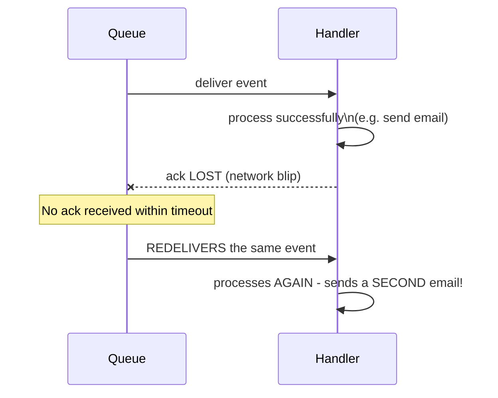

# Event-Driven Background Jobs — Middle

<!-- level-focus -->
At middle level, focus on this question:

> Why might your handler run twice for the same event, and what does that
> require your handler code to do?

Prerequisite: [`junior.md`](junior.md).

---

## At-least-once delivery is the default, not the exception

Almost every real message queue/event bus (SQS, Kafka, RabbitMQ, Pub/Sub)
provides **at-least-once delivery** by default: a message is redelivered if
the consumer doesn't acknowledge it within a timeout — which can happen
even after the consumer **successfully finished processing it**, if the
acknowledgment itself is lost or delayed.



This isn't a rare edge case — it's the queue behaving exactly as documented.
**Any handler not explicitly designed to tolerate duplicate delivery will
occasionally produce duplicate side effects** (a second email, a double
charge, a duplicated database row) under normal, expected operating
conditions, not just during outages.

## Making a handler idempotent

An **idempotent** handler produces the same end result whether it runs once
or many times for the same event.

```python
def handle_order_placed(event):
    order_id = event["order_id"]
    # Idempotency key check: has this exact event already been processed?
    if processed_events.exists(order_id):
        return  # already handled - safe no-op
    send_confirmation_email(order_id)
    processed_events.mark_done(order_id)
```

The `processed_events` check-and-mark must itself be atomic (a database
`INSERT ... ON CONFLICT DO NOTHING` or an equivalent unique-constraint-backed
write) — checking and marking as two separate, non-atomic steps
reintroduces the exact race a second concurrent redelivery could still slip
through.

> 🎓 **Takeaway:** at-least-once delivery is a property of the messaging
> infrastructure you almost certainly can't change — idempotency is the
> property your handler code must provide to make that safe. Treat "this
> event might be delivered more than once" as a certainty to design for,
> not a rare failure mode to hope doesn't happen.

## Test yourself

1. Why can an acknowledgment being lost cause redelivery even after the
   handler successfully finished its work — walk through the timing.
2. Why does a non-atomic "check if processed, then mark as processed" still
   allow duplicate processing under concurrent redelivery?
3. Design an idempotency key for a handler that processes "user uploaded a
   profile photo" events — what should the key be based on?

Continue to [`senior.md`](senior.md).
