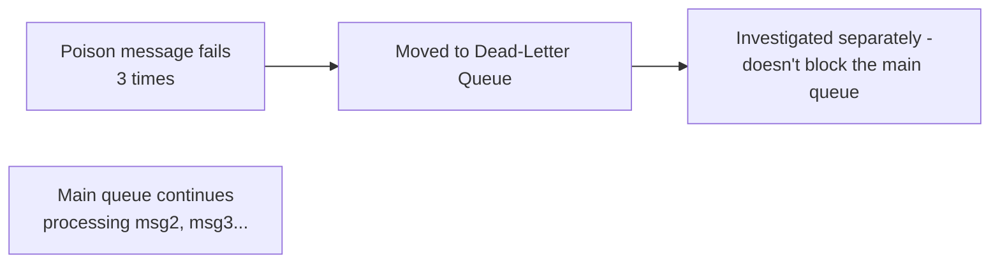
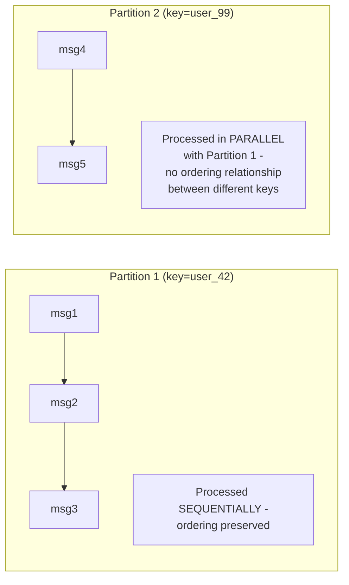

# Event-Driven Background Jobs — Senior

<!-- level-focus -->
At senior level, focus on this question:

> What happens when one malformed event blocks an entire queue, and how do
> ordering guarantees limit your ability to parallelize?

Prerequisite: [`middle.md`](middle.md).

---

## The poison message problem

If a handler repeatedly **fails** to process a specific event (a malformed
payload, a bug triggered only by this event's specific data), and the queue
keeps redelivering it for retry (per `middle.md`'s at-least-once model),
that one "poison" message can **block all events behind it** in
systems with strict ordering (like a single Kafka partition or an SQS FIFO
queue), because the consumer can't move on to the next message until the
current one is acknowledged.

```mermaid
flowchart LR
    Q["Queue: [poison msg][msg2][msg3][msg4]"] --> Handler[Handler]
    Handler -->|"processes poison msg,\nFAILS every time"| Retry["Retries forever,\nnever advances"]
    Retry -.-.-> Blocked["msg2, msg3, msg4 never\nget processed - stuck\nbehind the poison message"]
```

**The fix**: a **dead-letter queue (DLQ)**. After a bounded number of
failed attempts, the message is moved out of the main queue into a separate
DLQ for manual/automated investigation, and the consumer moves on to the
next message — trading "guaranteed eventual processing of every message in
strict order" for "the queue keeps flowing, and problem messages are
quarantined for separate handling."



## Ordering guarantees limit parallelism

Systems that guarantee **strict per-key ordering** (Kafka: ordering within
a partition; SQS FIFO: ordering within a message group) achieve this
specifically by processing that key's messages **sequentially, one
consumer at a time** — you cannot parallelize processing of events sharing
an ordering key without breaking the ordering guarantee itself. This is a
direct trade-off: more partitions/groups (finer-grained ordering keys) allow
more parallelism, but only within each key's own sequence; if your business
logic requires strict global ordering across everything, you cannot
parallelize at all without giving up that guarantee.



> 🎯 **Senior takeaway:** ordering and parallelism trade off directly
> against each other at the granularity of your chosen partition/ordering
> key. Choose the key deliberately — too coarse (one global ordering key)
> sacrifices all parallelism; too fine (no ordering at all) may violate a
> real business requirement (e.g. processing a user's events out of order
> could apply an "account closed" event before a preceding "purchase" event
> that should have blocked it).

## Test yourself

1. Why does a poison message specifically block *ordered* queues in a way
   it wouldn't block an unordered queue (where the consumer could simply
   skip ahead)?
2. Design the DLQ policy (retry count, backoff) for a handler processing
   payment-confirmation events, where losing a message silently would be
   unacceptable.
3. A queue partitions by `user_id` for ordering. What happens to
   parallelism if 90% of your traffic comes from a single, extremely active
   user's `user_id`?

Continue to [`professional.md`](professional.md) to design a production
event-driven job system's full failure-handling and observability story.
