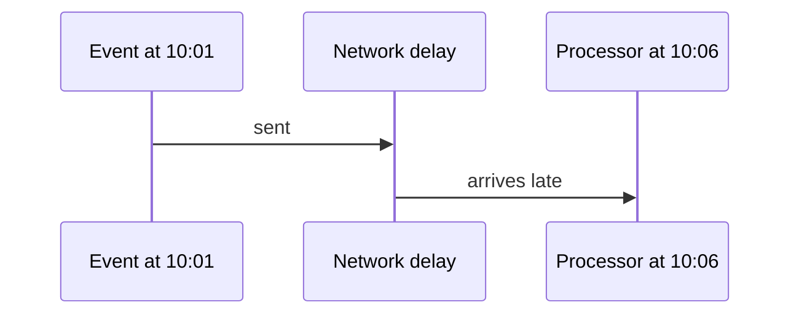

# Stateful Windowing - Junior
Streams do not end, so an aggregation needs a time boundary. Event time describes when an event happened; processing time describes when the system saw it.

A processing-time window puts this event in 10:06; an event-time window puts it in 10:01. Out-of-order arrival means the processor cannot wait forever for perfect completeness.
## Test yourself
1. Why do streams need windows?
2. How do event and processing time differ?
3. Why can a result never be both immediate and perfectly complete?
Continue to [`middle.md`](middle.md).
