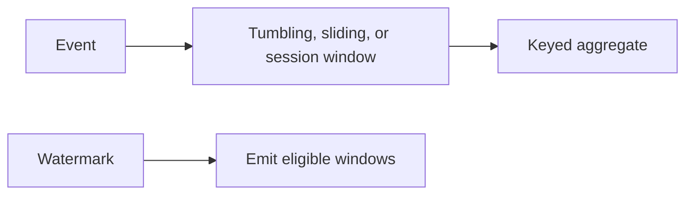

# Stateful Windowing - Middle
A watermark states that event time has probably advanced past a point. Windows behind it may emit; allowed lateness keeps them open for corrections.

Flink partitions state by key, checkpoints state and source positions, then restores both after failure. Choose tumbling windows for non-overlapping reports, sliding windows for rolling metrics, and sessions for activity separated by gaps.
## Test yourself
1. What promise does a watermark make?
2. Why are sliding windows more expensive?
3. What must a checkpoint include?
Continue to [`senior.md`](senior.md).
