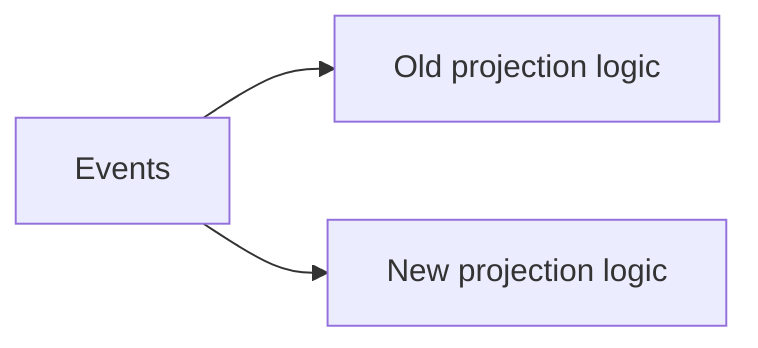

# Event Replay - Junior
A projection is a query-friendly view derived from events. New logic, corruption, or a new index may require rebuilding it.

Updating the live table in place risks mixed old/new semantics and downtime. An immutable retained log allows deterministic reconstruction if handlers remain compatible and idempotent.
## Test yourself
1. What is a projection?
2. Why rebuild from events?
3. Why not overwrite the live view immediately?
Continue to [`middle.md`](middle.md).
