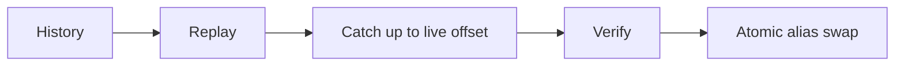

# Event Replay - Middle
Create a new versioned projection, replay historical partitions, then consume the remaining live tail before atomic cutover.

Store the last applied offset/version with each aggregate. Throttle replay so it does not starve live consumers. Compare counts, checksums, and sampled aggregates before switching the serving alias.
## Test yourself
1. What marks replay progress?
2. How does blue/green cutover avoid downtime?
3. Why throttle historical replay?
Continue to [`senior.md`](senior.md).
