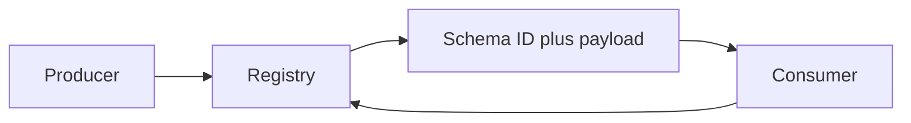

# Schema Registry and Evolution
> Evolve event contracts without breaking mixed-version producers, consumers, or historical replay.

| Level | Guide | You are done when |
|---|---|---|
| Junior | [Definition and why](junior.md) | You can explain contract drift. |
| Middle | [How it works](middle.md) | You can choose compatibility mode. |
| Senior | [Failures and mistakes](senior.md) | You can plan safe rolling evolution. |
| Professional | [Best practices and scale](professional.md) | You can govern contracts and replay. |
**Practice rule:** Test a new schema against all retained history, not only the latest version.
## Related
[CDC](../01-cdc-pipeline/README.md) | [Replay](../03-event-replay-and-reprojection/README.md)
