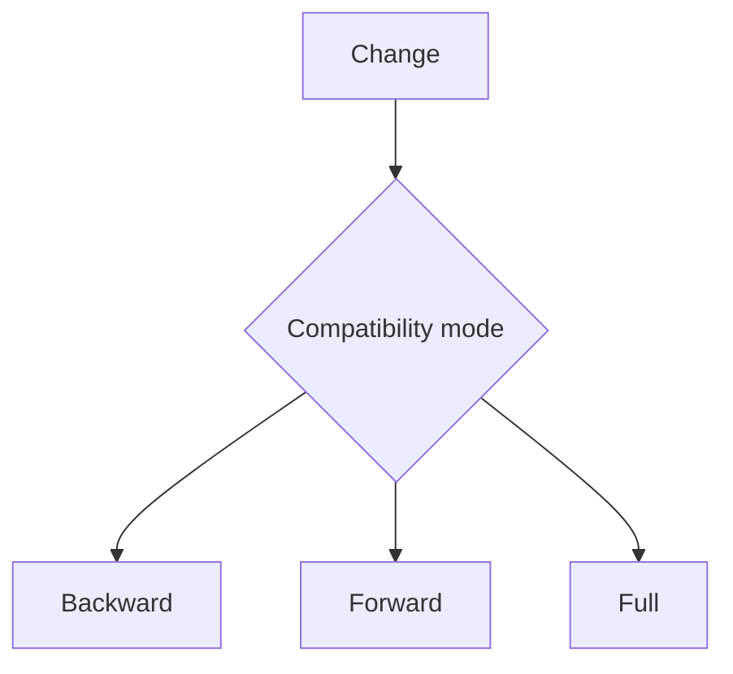

# Schema Evolution - Middle
Backward compatibility lets new readers consume old data; forward lets old readers consume new data; full requires both.

Avro commonly encodes a schema ID plus binary payload. Add optional fields with defaults, deploy tolerant readers before writers, and enforce compatibility in CI. Transitive mode checks against every prior version, which matters for replay.
## Test yourself
1. Which mode supports new readers of old events?
2. Why deploy readers first?
3. What does transitive checking add?
Continue to [`senior.md`](senior.md).
