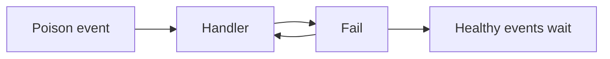

# DLQ and Retry - Junior
Immediate retry can repeatedly hit a failing dependency and block every later message. Invalid data will never succeed unchanged.

Retry transient timeouts; quarantine permanent validation failures. A DLQ is not deletion: it needs ownership and a repair path.
## Test yourself
1. What makes a failure transient?
2. How does poison data cause head-of-line blocking?
3. Why is a DLQ not a complete solution?
Continue to [`middle.md`](middle.md).
