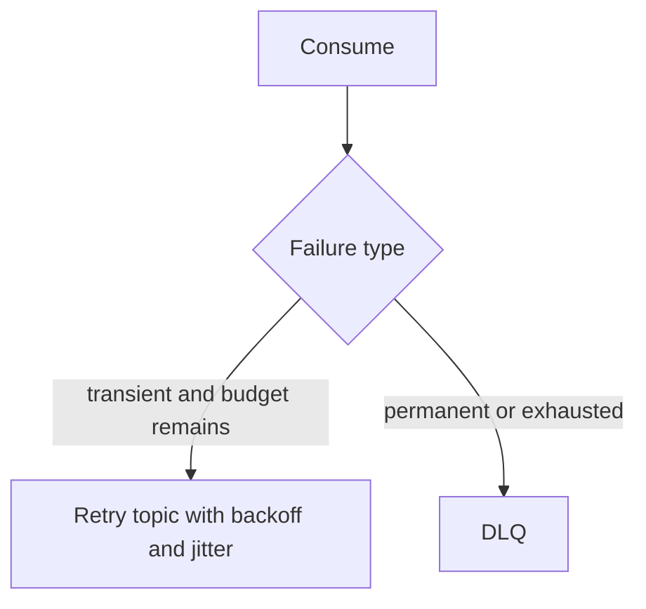

# DLQ and Retry - Middle
Non-blocking retry publishes failures to delayed retry topics, freeing the main consumer.

Carry original topic/partition/offset, attempt count, error class, and next-attempt time. Make effects idempotent because republishing changes offsets and can reorder a key.
## Test yourself
1. What metadata supports diagnosis?
2. Why add jitter?
3. How can retry topics alter order?
Continue to [`senior.md`](senior.md).
