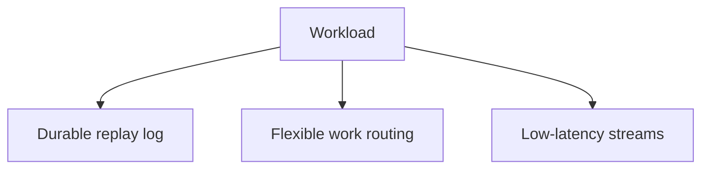

# Broker Selection: Kafka, RabbitMQ, and NATS JetStream
> Choose a broker from workload semantics and measured failure behavior, not popularity.

| Level | Guide | You are done when |
|---|---|---|
| Junior | [Definition and why](junior.md) | You can distinguish log, queue, and stream needs. |
| Middle | [How they work](middle.md) | You can compare matched guarantees. |
| Senior | [Failures and mistakes](senior.md) | You can test slow consumers and failover. |
| Professional | [Best practices and scale](professional.md) | You can make an evidence-based platform choice. |
**Practice rule:** Compare brokers under identical durability, payload, and acknowledgement settings.
## Related
[Consumer autoscaling](../08-consumer-autoscaling-on-lag/README.md)
