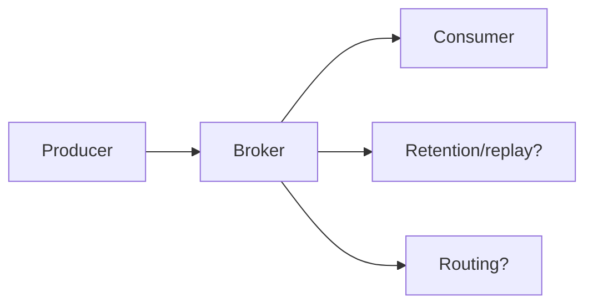

# Broker Selection - Junior
Kafka is a retained partitioned log, RabbitMQ centers queues and exchanges, and JetStream adds durable streams to NATS.

Start from ordering, replay, routing, latency, retention, and operations. A throughput headline without matched durability is not a fair comparison.
## Test yourself
1. Which workload requires replay?
2. What does queue routing provide?
3. Why match durability settings?
Continue to [`middle.md`](middle.md).
