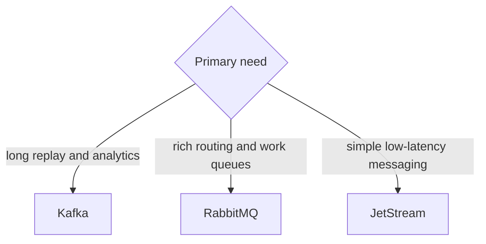

# Broker Selection - Middle

Build one adapter contract and run identical payload, producer, consumer, acknowledgement, replication, and failure tests. Record throughput, p50/p99, redelivery, ordering, recovery time, and operator effort.
## Test yourself
1. What must the common adapter expose?
2. Why test slow consumers?
3. Which guarantees cannot one generic API hide?
Continue to [`senior.md`](senior.md).
