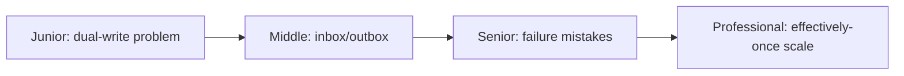
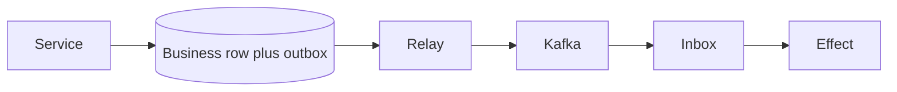

# Idempotent Inbox and Transactional Outbox
> Atomically record intended messages and deduplicate received messages across database-broker boundaries.

| Level | Guide | You are done when |
|---|---|---|
| Junior | [Definition and why](junior.md) | You can explain the dual-write gap. |
| Middle | [How it works](middle.md) | You can make publication and consumption idempotent. |
| Senior | [Failures and mistakes](senior.md) | You can handle crashes and dedup lifecycle. |
| Professional | [Best practices and scale](professional.md) | You can operate effectively-once effects. |
**Practice rule:** Make intent atomic locally; assume every message can repeat.
## Related
[CDC](../01-cdc-pipeline/README.md) | [DLQ/retry](../05-dlq-and-retry-topology/README.md)
