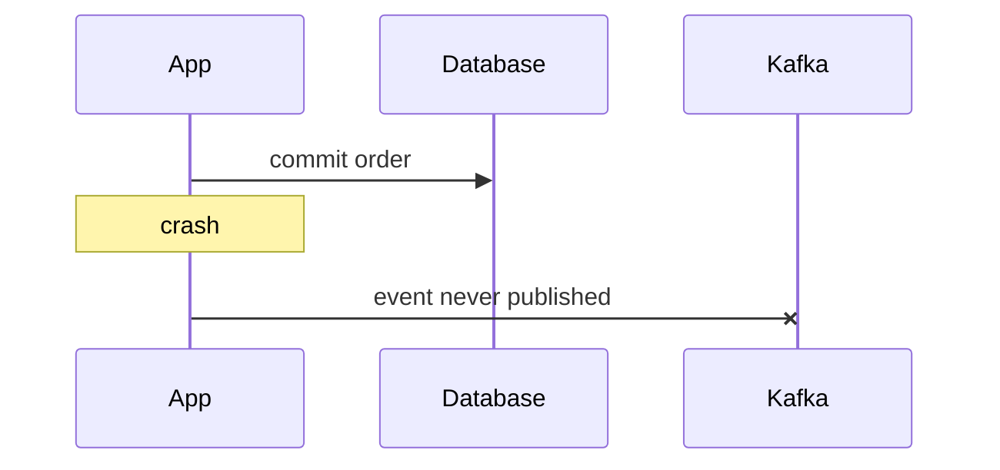

# Inbox and Outbox - Junior
Writing a business row and publishing Kafka separately creates a dual-write gap.

Reversing the order can publish an event for a transaction that later fails. Local atomic storage plus retryable delivery is safer than trying to time two systems perfectly.
## Test yourself
1. What is the dual-write gap?
2. Why is publish-first also unsafe?
3. Why must consumers expect duplicates?
Continue to [`middle.md`](middle.md).
