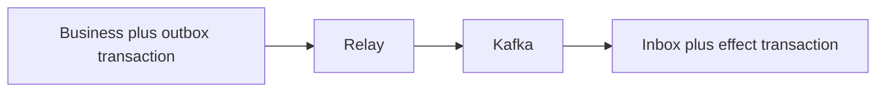

# Inbox and Outbox - Middle
Write business data and an outbox row in one transaction. A relay publishes unsent rows; consumers record message ID in an inbox transaction with the business effect.

Use a globally stable event ID. Publishing and marking sent still has a crash gap, so relay duplicates are expected. A unique inbox key turns redelivery into a no-op.
## Test yourself
1. Which writes share the producer transaction?
2. Why can the relay publish twice?
3. Which writes share the consumer transaction?
Continue to [`senior.md`](senior.md).
