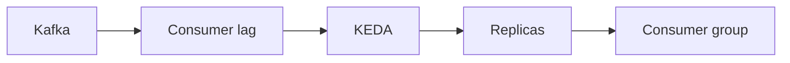

# Consumer Autoscaling on Lag
> Scale consumers from backlog age and processing capacity, while respecting partition parallelism and rebalance cost.

| Level | Guide | You are done when |
|---|---|---|
| Junior | [Definition and why](junior.md) | You can explain why CPU misses backlog. |
| Middle | [How it works](middle.md) | You can turn lag into bounded replicas. |
| Senior | [Failures and mistakes](senior.md) | You can prevent flapping and unsafe scale-down. |
| Professional | [Best practices and scale](professional.md) | You can design a stable autoscaling control loop. |
**Practice rule:** Scale to drain work within an SLO, never beyond useful partition parallelism.
## Related
[Broker selection](../06-broker-bake-off/README.md)
