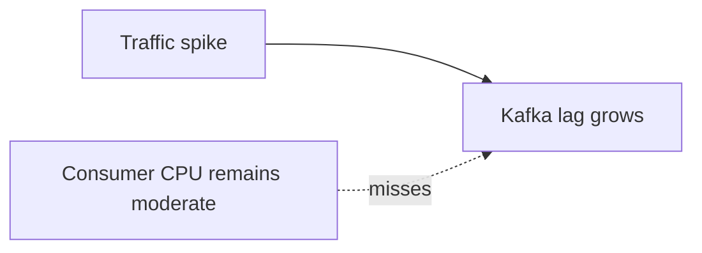

# Consumer Autoscaling - Junior
Consumer CPU can be low while millions of events wait, especially when each event blocks on I/O. Lag measures records not yet processed.

More consumers increase throughput only until every partition has an active consumer. Scale decisions should target backlog drain time, not zero lag at any cost.
## Test yourself
1. Why can CPU hide a backlog?
2. What limits useful consumer count?
3. Why is lag age useful?
Continue to [`middle.md`](middle.md).
