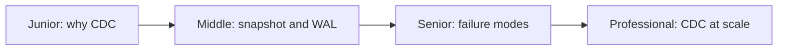
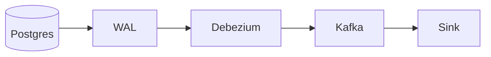

# Change Data Capture Pipeline
> Turn committed database changes into an ordered event stream without polling.

| Level | Guide | You are done when |
|---|---|---|
| Junior | [Definition and why](junior.md) | You can explain why polling misses changes. |
| Middle | [How it works](middle.md) | You can trace snapshot-to-stream cutover. |
| Senior | [Failures and mistakes](senior.md) | You can protect ordering, replay, and WAL disk. |
| Professional | [Best practices and scale](professional.md) | You can operate high-volume CDC. |
**Practice rule:** Monitor source-log retention as carefully as consumer lag.
## Related
[Inbox/outbox](../idempotent-inbox-outbox/README.md) | [Schema evolution](../schema-registry-and-evolution/README.md)
