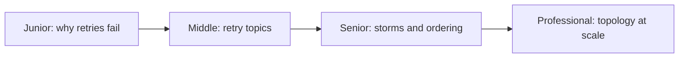
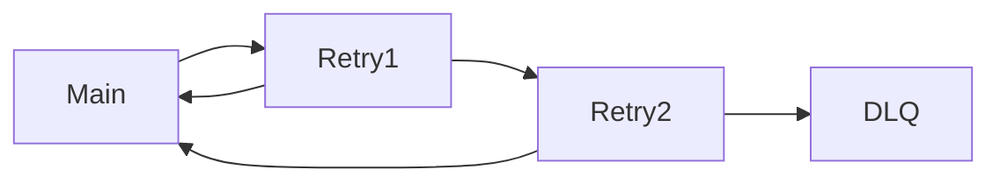

# DLQ and Retry Topology
> Retry transient failures without blocking healthy traffic, and quarantine permanent failures for controlled repair.

| Level | Guide | You are done when |
|---|---|---|
| Junior | [Definition and why](junior.md) | You can classify transient and permanent failures. |
| Middle | [How it works](middle.md) | You can route bounded delayed retries. |
| Senior | [Failures and mistakes](senior.md) | You can control storms, poison data, and order. |
| Professional | [Best practices and scale](professional.md) | You can operate DLQ growth and replay. |
**Practice rule:** Every retry needs a budget, delay, reason, and terminal destination.
## Related
[Inbox/outbox](../idempotent-inbox-outbox/README.md)
