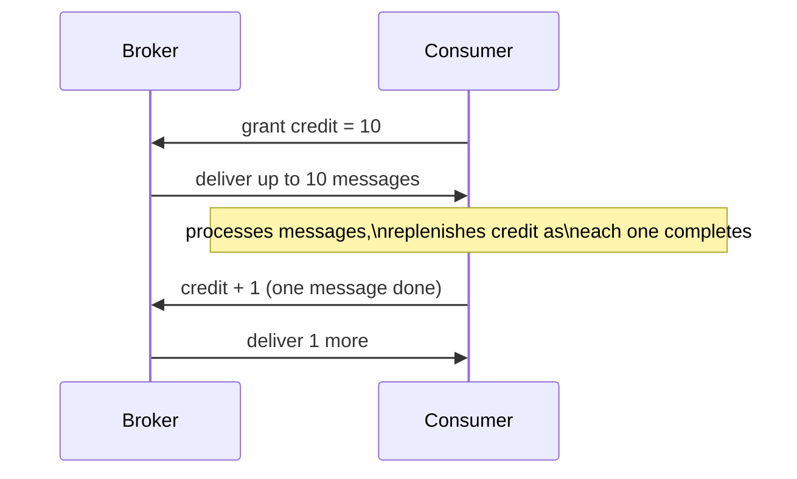
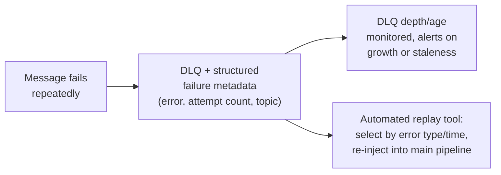

# Event-Driven Background Jobs — Professional

<!-- level-focus -->
At professional level, focus on this question:

> How do production event-driven systems implement backpressure internally
> (credit-based flow control), and what does a fully-specified DLQ/replay
> architecture look like at scale?

Prerequisite: [`senior.md`](senior.md).

---

## Credit-based flow control: how backpressure actually works at the protocol level

A naive event-driven consumer that pulls messages as fast as it can risks
overwhelming downstream systems (a database, a third-party API) it calls
during processing. Production messaging protocols implement **credit-based
flow control**: the consumer explicitly grants the broker a "credit"
(a count of messages it's currently willing to receive), the broker sends
up to that many messages and stops, and the consumer replenishes credit as
it finishes processing — this is the actual mechanism behind AMQP's
`basic.qos` (prefetch count) and reactive-streams-based consumers (Project
Reactor, RxJava) more generally.



This is a fundamentally different mechanism from simple **rate limiting**
(a fixed messages/second cap): credit-based flow control adapts
automatically to the consumer's actual real-time processing speed —
if a downstream dependency slows down, credit replenishment naturally
slows, and the broker automatically backs off without any external rate
adjustment needed. This is the production-grade generalization of `middle.md`'s
implicit assumption that a consumer "pulls when ready" — credit-based flow
control makes that assumption an explicit, protocol-level contract.

## Full DLQ/replay architecture: beyond "move it and investigate"

`senior.md`'s DLQ description is the minimum viable version. A production
system's DLQ architecture typically adds:

- **Structured failure metadata** attached to every DLQ'd message: original
  topic/queue, failure count, the actual exception/error per attempt, and a
  timestamp per attempt — without this, "investigate the DLQ" becomes
  archaeology instead of a fast diagnostic loop.
- **Automated replay tooling**, not manual reprocessing: a mechanism to
  select a batch of DLQ'd messages (by error type, time range, or a fixed
  fix having been deployed) and re-inject them into the main processing
  pipeline — critical because manually re-publishing individual failed
  messages doesn't scale past a handful of incidents.
- **DLQ depth and age as first-class alerting metrics**: a growing DLQ
  (more messages failing than being triaged/replayed) or an aging DLQ
  (messages sitting untouched for days) are both leading indicators of a
  process or ownership gap, not just a technical queue-depth number.



## Choosing the ordering-key granularity as a capacity-planning decision

`senior.md` established the ordering-vs-parallelism trade-off; at
production scale, this becomes an explicit capacity-planning exercise:
Kafka partition count (the practical unit of both ordering scope and
parallelism) must be sized against **expected peak throughput divided by
per-partition consumer throughput**, while also respecting the business's
actual ordering requirements (which entities genuinely need strict
ordering relative to each other, and which don't). Increasing partition
count later to add parallelism is possible but has real costs (existing
consumer group rebalancing, and critically, **changing partition count
changes which partition a given key hashes to**, potentially breaking
ordering guarantees for keys whose messages span the transition) —
professional-level systems size this deliberately upfront with headroom,
rather than treating it as a purely reactive scaling lever.

## Production checklist (staff-level)

1. **Use credit-based flow control (or a client library that implements
   it) rather than a fixed polling rate**, for any consumer whose
   processing speed depends on a variable-latency downstream dependency —
   it adapts automatically where fixed rate limits require manual
   re-tuning as conditions change.
2. **Attach structured failure metadata to every DLQ'd message** as a
   non-negotiable requirement, not an optional enhancement — this is the
   difference between fast incident triage and slow archaeology.
3. **Build (or adopt) automated DLQ replay tooling before you need it at
   scale** — manual re-publishing does not scale past a handful of
   messages and becomes the bottleneck in incident recovery.
4. **Monitor DLQ depth and age as SLO-relevant metrics with explicit
   alerting thresholds**, not just as a debugging tool checked reactively.
5. **Size ordering-key/partition granularity with real throughput
   headroom upfront**, understanding that changing it later can silently
   break in-flight ordering guarantees for keys spanning the transition —
   treat this as a capacity-planning decision made early, not a lever
   pulled casually later.

## Cheat Sheet

```text
+------------------------------------------------------------------+
|          EVENT-DRIVEN BACKGROUND JOBS — INTERNALS & SCALE            |
+------------------------------------------------------------------+
| Credit-based flow control (AMQP basic.qos, reactive streams):          |
| consumer grants broker explicit "credit," replenishes as it finishes   |
| processing - adapts AUTOMATICALLY to real processing speed, unlike     |
| a fixed rate limit that needs manual re-tuning as conditions change    |
+------------------------------------------------------------------+
| Production DLQ = structured failure metadata (error, attempt count,    |
| origin) + AUTOMATED REPLAY tooling (batch re-injection by error         |
| type/time) + DLQ depth/age as first-class ALERTING metrics             |
+------------------------------------------------------------------+
| Partition/ordering-key count = a CAPACITY-PLANNING decision, sized      |
| against peak throughput / per-partition consumer throughput, made       |
| upfront with headroom - changing it later can silently break            |
| in-flight ordering guarantees because it changes which partition a     |
| given key hashes to                                                    |
+------------------------------------------------------------------+
```

## Test yourself

1. Explain why credit-based flow control adapts to a slowing downstream
   dependency automatically, while a fixed rate limit would require manual
   intervention to avoid either overwhelming the consumer or under-utilizing
   it.
2. Design the structured failure metadata schema you'd attach to every
   message landing in a production DLQ.
3. Why can increasing Kafka partition count to add parallelism silently
   break ordering guarantees for keys whose messages span the transition,
   and how would you plan around this risk?

## Further Reading

- Reactive Streams specification — the formal credit-based backpressure
  protocol underlying reactive consumer libraries.
- AMQP 0-9-1 specification — `basic.qos` (prefetch/credit mechanics).
- Confluent/Kafka documentation — "Partitions" and consumer group
  rebalancing behavior when partition count changes.
- See also: [Dead Letter Queues](../../../event-streaming/16-asynchronism/dead-letter-queues/README.md),
  [Delivery Guarantees](../../../event-streaming/16-asynchronism/delivery-guarantees/README.md).
