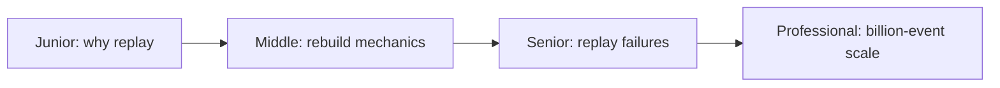
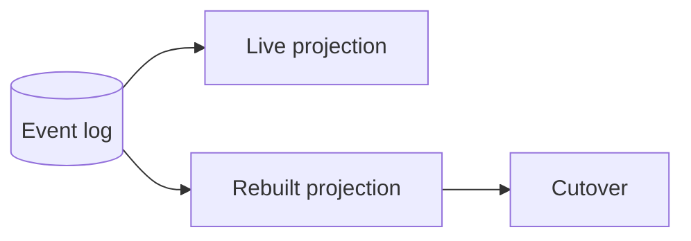

# Event Replay and Reprojection
> Rebuild a derived view from an immutable event log without disrupting the live view.

| Level | Guide | You are done when |
|---|---|---|
| Junior | [Definition and why](junior.md) | You can explain projection rebuilds. |
| Middle | [How it works](middle.md) | You can replay, catch up, and cut over. |
| Senior | [Failures and mistakes](senior.md) | You can prevent duplicates and stale cutover. |
| Professional | [Best practices and scale](professional.md) | You can operate large online rebuilds. |
**Practice rule:** Build beside the live view; never destroy the only serving copy first.
## Related
[CDC](../cdc-pipeline/README.md) | [Schema evolution](../schema-registry-and-evolution/README.md)
