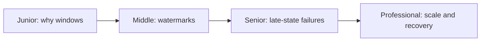
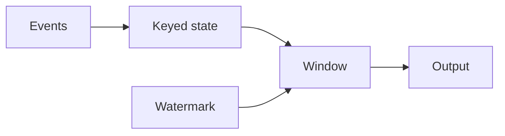

# Stateful Windowing Processor
> Group unbounded events by event time while handling late data and recoverable state.

| Level | Guide | You are done when |
|---|---|---|
| Junior | [Definition and why](junior.md) | You can distinguish event time from processing time. |
| Middle | [How it works](middle.md) | You can assign windows and watermarks. |
| Senior | [Failures and mistakes](senior.md) | You can bound lateness and state. |
| Professional | [Best practices and scale](professional.md) | You can operate checkpointed keyed state. |
**Practice rule:** Define how late is too late before choosing a watermark.
## Related
[Replay](../event-replay-and-reprojection/README.md)
