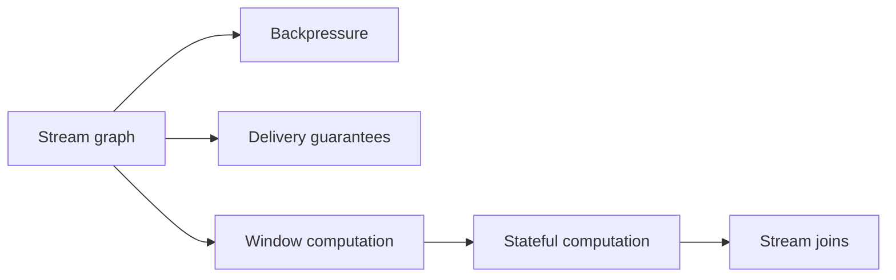
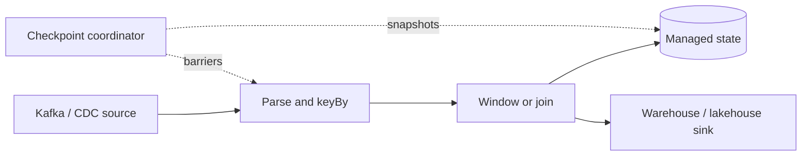

# Stream Processing

> Stream processing turns unbounded event logs into continuously updated results
> by routing records through an operator graph while managing time, state,
> failures, and flow control explicitly.

## Topics

| Topic | Core question |
|---|---|
| [Stream Graph](stream-graph/README.md) | How does a logical pipeline become a parallel operator DAG? |
| [Backpressure](backpressure/README.md) | How does overload propagate through a running stream job? |
| [Delivery Guarantees](delivery-gurantees/README.md) | How do source offsets, state, and sinks recover consistently? |
| [Window Computation](windown-computation/README.md) | How are unbounded events grouped using event time and watermarks? |
| [Stateful Computation](stateful-computation/README.md) | How is keyed state stored, checkpointed, and rescaled? |
| [Join Operations](join-operation/README.md) | How do streams join when records arrive late and out of order? |

## Learning path

Start with the graph and backpressure topics to understand execution. Then study
delivery guarantees before windows, state, and joins, because all stateful
operators rely on coordinated recovery semantics.

## Practice rule

For every streaming design, write down the event-time policy, partition key,
state retention, recovery boundary, sink commit protocol, and overload behavior.
If one is implicit, correctness is implicit too.

## Related

- [Event-driven systems](../events-driven/)
- [Messaging and asynchronism](../asynchronism/)
- [Stateful windowing processor lab](../events-driven/02-stateful-windowing-processor/README.md)
